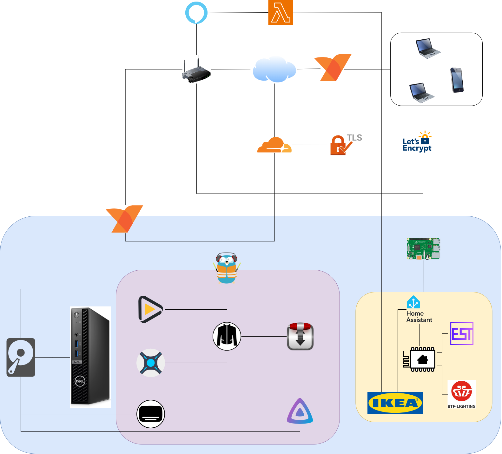

# My Homelab

This is my current [HTPC](https://en.wikipedia.org/wiki/Home_theater_PC) setup. It runs on [k3s](https://k3s.io/) - a lightweight and easy to install Kubernetes distribution.
It includes the following applications:

* [Sonarr](https://sonarr.tv/) for tv shows
* [Radarr](https://radarr.video/) for movies
* [Bazarr](https://github.com/morpheus65535/bazarr) for subtitles
* Transmission for torrents
* [Jackett](https://github.com/Jackett/Jackett) for torrent tracker searching
* [Emby](https://emby.media/) 

Credits:
1) [htk8s](https://github.com/fabito/htk8s)