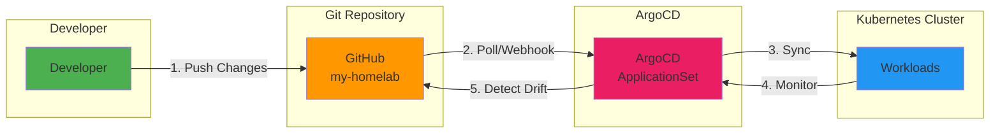
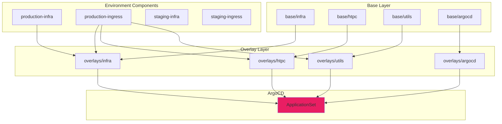

# Configuration Management

The configuration system follows modern GitOps principles using Kustomize for declarative configuration management.

## GitOps Principles



!!! note "Configuration Strategy"
    The configuration management system is designed to be maintainable, secure, and
    scalable while following GitOps best practices.

### Git as Single Source of Truth

- All configurations versioned in Git
- Changes applied through Git commits
- Audit trail of all modifications
- Easy rollback to previous states

### Declarative Configuration

- Desired state defined in YAML
- Kubernetes reconciles actual state
- No manual cluster modifications
- Automated drift correction

### Automated Synchronization

- ArgoCD watches Git repository
- Automatic deployment on changes
- Configurable sync policies
- Manual sync available when needed

## Directory Structure



```text
.
├── base/                          # Base configurations
│   ├── htpc/                      # Media services
│   │   ├── kustomization.yaml
│   │   ├── jellyfin/
│   │   ├── sonarr/
│   │   ├── radarr/
│   │   └── ...
│   ├── infra/                     # Infrastructure
│   │   ├── kustomization.yaml
│   │   ├── traefik/
│   │   ├── cert-manager/
│   │   ├── monitoring/
│   │   └── ...
│   └── utils/                     # Utilities
│       ├── kustomization.yaml
│       ├── nextcloud/
│       ├── immich/
│       └── ...
├── overlays/                      # Environment overlays
│   ├── argocd/
│   │   └── kustomization.yaml
│   └── environment/
│       ├── staging-infra/
│       ├── staging-ingress/
│       ├── production-infra/
│       └── production-ingress/
└── scripts/                       # Automation scripts
    ├── bootstrap.sh
    ├── kickstart.sh
    └── ...
```

## Base Configurations

Base configurations contain common settings shared across environments.

### Structure

Each service has its own directory:

```text
base/utils/nextcloud/
├── deployment.yaml          # Application deployment
├── service.yaml            # Kubernetes service
├── ingress-route.yaml     # Traefik ingress
├── persistent-volume-claim.yaml
├── configmap.yaml         # Configuration
└── kustomization.yaml     # Kustomize config
```

### Example Kustomization

??? example "View Base Utils Kustomization"
    ```yaml
    --8<-- "base/utils/kustomization.yaml"
    ```

??? example "View Base Infrastructure Kustomization"
    ```yaml
    --8<-- "base/infra/kustomization.yaml"
    ```

??? example "View Base HTPC Kustomization"
    ```yaml
    --8<-- "base/htpc/kustomization.yaml"
    ```

## Environment Overlays

Overlays customize base configurations for specific environments.

### Environment Components

This project uses Kustomize Components for environment-specific configurations, allowing
flexible composition of certificate issuers and ingress routes.

??? example "View Staging Infrastructure Component"
    ```yaml
    --8<-- "overlays/environment/staging-infra/kustomization.yaml"
    ```

??? example "View Staging Ingress Component"
    ```yaml
    --8<-- "overlays/environment/staging-ingress/kustomization.yaml"
    ```

The staging environment:

- Uses Let's Encrypt staging server for certificates
- Patches certificate secret names
- Modifies ingress routes to use staging certificates

??? example "View Production Infrastructure Component"
    ```yaml
    --8<-- "overlays/environment/production-infra/kustomization.yaml"
    ```

??? example "View Production Ingress Component"
    ```yaml
    --8<-- "overlays/environment/production-ingress/kustomization.yaml"
    ```

The production environment:

- Uses Let's Encrypt production server for certificates
- Patches certificate secret names for production
- Modifies ingress routes to use production certificates

??? example "View Infrastructure Overlay"
    ```yaml
    --8<-- "overlays/infra/kustomization.yaml"
    ```

## Configuration Principles

### 1. Immutability

#### Version Control Everything

- All changes tracked in Git
- Commit messages describe changes
- Branch protection for main branch
- Code review before merge

#### No Direct Modifications

- No `kubectl edit` in production
- All changes through GitOps
- Infrastructure as Code
- Reproducible deployments

#### Automated Rollback

- Git revert for rollbacks
- ArgoCD history tracking
- Quick recovery from issues

#### Change History

- Full audit trail in Git
- Who changed what and when
- Reason for changes in commits

### 2. Separation of Concerns

#### Environment-Specific Settings

Overlays modify only environment-specific values (e.g., replica count: 1 for staging, 3 for production)
using strategic merge patches or JSON patches.

#### Shared Configurations

Base configurations contain common resources shared across all environments (deployment.yaml, service.yaml, configmap.yaml).

#### Clear Dependencies

Explicitly reference ConfigMaps and Secrets using `configMapRef` or `secretRef` in container specs for clear dependency tracking.

#### Modular Design

Each service is self-contained and can be deployed independently.

### 3. Validation

#### Schema Validation

```bash
# Validate Kubernetes schemas
kubeconform -strict -summary base/
```

#### Configuration Testing

```bash
# Build and validate manifests
kustomize build overlays/production-infra/ | kubectl apply --dry-run=client -f -
```

#### Drift Detection

ArgoCD continuously monitors for drift:

- Compares Git state with cluster state
- Alerts on unexpected changes
- Can auto-sync or require manual approval

### 4. Secret Management

#### Encrypted at Rest

- Kubernetes Secrets with base64 encoding
- Etcd encryption for secret storage
- External secrets integration possible

#### Environment Separation

```text
base/utils/nextcloud/secret.yaml  # Template
overlays/staging/secret-patch.yaml  # Staging values
overlays/production/secret-patch.yaml  # Production values
```

#### Access Auditing

- Kubernetes audit logs
- Track secret access
- Alert on unauthorized access

#### Automated Rotation

- Regular credential rotation
- Automated where supported
- Manual rotation procedures documented

## ArgoCD Integration

### ApplicationSet Definition

The project uses an ApplicationSet to manage multiple applications from a single definition.

??? example "View ApplicationSet Configuration"
    ```yaml
    --8<-- "argocd/app/application.yaml"
    ```

This ApplicationSet:

- Creates applications for `argocd`, `infra`, `htpc`, and `utils` namespaces
- Uses a list generator to define applications
- Configures automated sync with pruning
- Enables server-side apply for better performance
- Handles CNPG operator field differences

## Configuration Workflow

### Making Changes

1. **Create Branch**

    ```bash
    git checkout -b feature/update-service
    ```

2. **Modify Configuration**

    Edit YAML files in base or overlays

3. **Validate Locally**

    ```bash
    ./scripts/validate.sh
    kustomize build overlays/production/ | kubectl apply --dry-run=client -f -
    ```

4. **Commit and Push**

    ```bash
    git add .
    git commit -m "Update service configuration"
    git push origin feature/update-service
    ```

5. **Create Pull Request**

    Review changes before merging

6. **Merge to Main**

    ArgoCD automatically syncs changes

### Emergency Rollback

```bash
# Option 1: Git revert
git revert <commit-hash>
git push origin main

# Option 2: ArgoCD rollback
argocd app rollback <app-name> <revision>

# Option 3: Manual sync to previous version
argocd app sync <app-name> --revision <git-commit>
```

## Best Practices

### Configuration Organization

- **Logical grouping**: Group related resources
- **Clear naming**: Descriptive resource names
- **Consistent structure**: Follow established patterns
- **Documentation**: Comment complex configurations

### Version Control

- **Meaningful commits**: Descriptive commit messages
- **Atomic changes**: One logical change per commit
- **Feature branches**: Isolate changes
- **Code review**: Peer review before merge

### Testing

- **Validate locally**: Test before committing
- **Staging first**: Deploy to staging environment
- **Gradual rollout**: Phased production deployment
- **Monitor**: Watch metrics after deployment

### Security

- **No secrets in Git**: Use secret management
- **Least privilege**: Minimal RBAC permissions
- **Regular audits**: Review configurations
- **Encryption**: Encrypt sensitive data

## Troubleshooting

### ArgoCD Sync Issues

```bash
# Check application status
argocd app get <app-name>

# View sync status
argocd app sync <app-name> --dry-run

# Force sync
argocd app sync <app-name> --force
```

### Kustomize Build Errors

```bash
# Validate kustomization
kustomize build <path> --enable-helm

# Check for missing resources
kustomize build <path> --load-restrictor LoadRestrictionsNone
```

### Configuration Drift

```bash
# Detect drift
argocd app diff <app-name>

# View differences
kubectl diff -f <manifest>

# Sync to desired state
argocd app sync <app-name>
```

## Related Documentation

- [Kubernetes Infrastructure](kubernetes-infrastructure.md) - Cluster configuration
- [CI/CD](cicd.md) - Deployment pipelines
- [Configuration: Secrets](../configuration/secrets.md) - Secret management
