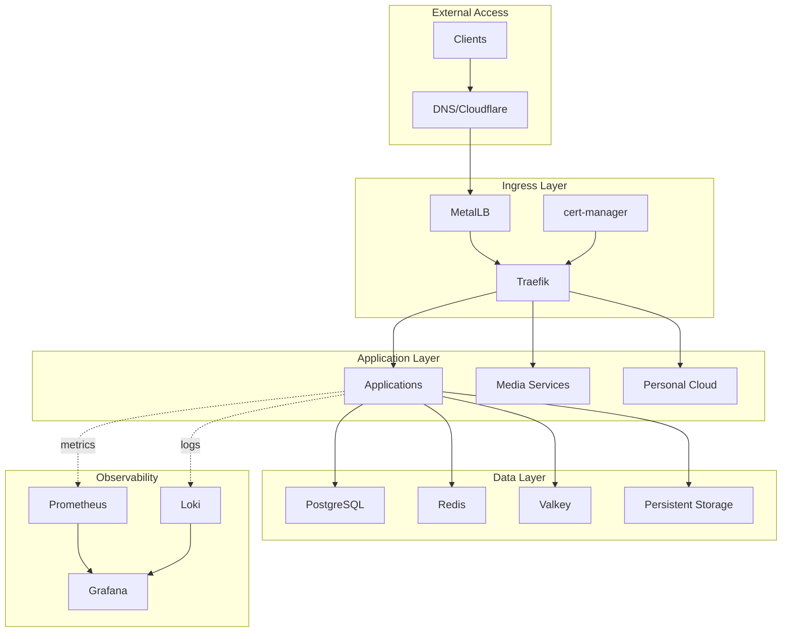
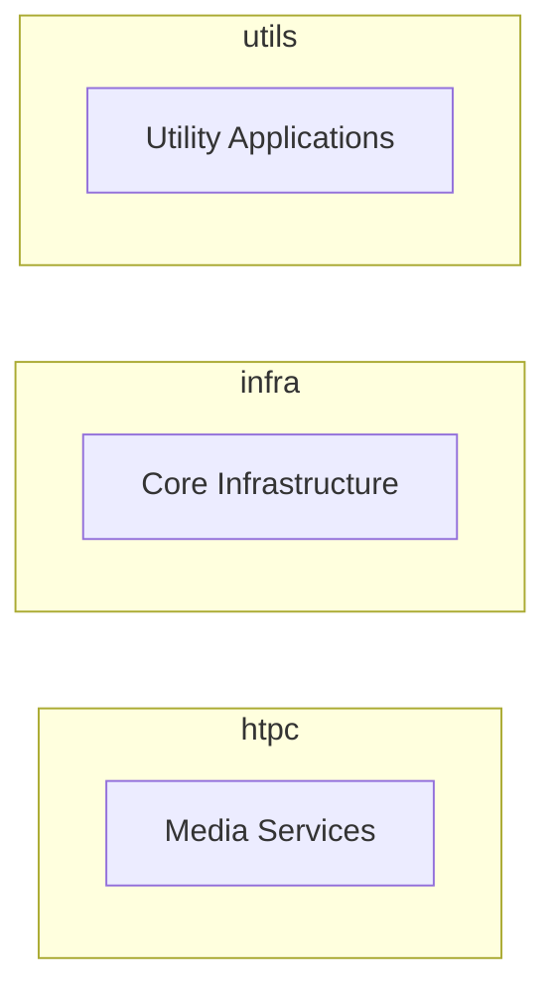

# Architecture

Understanding the architecture of the homelab platform is essential for effective operation, customization, and troubleshooting.

## Architecture Overview

The platform is built on a microservices architecture, leveraging Kubernetes orchestration
for scalability, reliability, and maintainability. Each component is designed to be modular,
allowing for independent updates and scaling.

## Key Design Principles

!!! note "Infrastructure as Code"
    All infrastructure is defined declaratively using Kubernetes manifests and Kustomize
    overlays. This ensures reproducibility and version control.

!!! note "GitOps Workflow"
    Changes are applied through Git commits, with ArgoCD automatically synchronizing the cluster state with the repository.

!!! note "Security First"
    Multiple layers of security protect services and data, from network policies to encrypted secrets and TLS termination.

!!! note "Observability"
    Comprehensive monitoring, logging, and tracing provide full visibility into system behavior and performance.

## Architecture Deep Dive

Explore the detailed architecture documentation:

- :material-view-grid:{ .lg .middle } [__Overview__](overview.md)

    ---

    High-level system design and architecture diagrams

- :material-kubernetes:{ .lg .middle } [__Kubernetes Infrastructure__](kubernetes-infrastructure.md)

    ---

    k3s cluster configuration and resource management

- :material-network:{ .lg .middle } [__Networking__](networking.md)

    ---

    Ingress, load balancing, and certificate management

- :material-database:{ .lg .middle } [__Storage__](storage.md)

    ---

    Persistent storage and volume management

- :material-shield-lock:{ .lg .middle } [__Security__](security.md)

    ---

    Security layers and protection mechanisms

- :material-cog:{ .lg .middle } [__Configuration Management__](configuration-management.md)

    ---

    GitOps and Kustomize-based configuration

- :material-git:{ .lg .middle } [__CI/CD__](cicd.md)

    ---

    Continuous integration and deployment pipelines

- :material-chart-line:{ .lg .middle } [__Observability__](observability.md)

    ---

    Monitoring, logging, and distributed tracing

## Architecture Diagrams

### System Overview

The system employs a layered architecture:

### Namespace Organization

The platform is organized into three dedicated namespaces:

## Next Steps

Dive deeper into specific architectural components:

- Learn about [Kubernetes Infrastructure](kubernetes-infrastructure.md) for cluster details
- Explore [Networking](networking.md) for ingress and routing
- Review [Security](security.md) for protection layers
- Understand [Observability](observability.md) for monitoring
