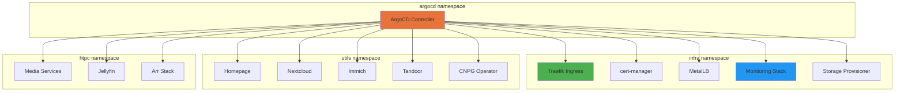
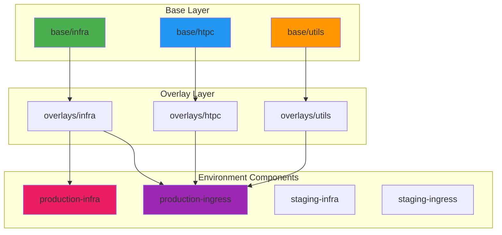

# Kubernetes Infrastructure

The platform is built on k3s, a lightweight Kubernetes distribution optimized for
resource-constrained environments and edge computing.

## k3s Overview

[k3s](https://k3s.io/) is a certified Kubernetes distribution designed for:

- **Edge computing**: Low resource footprint
- **IoT**: ARM support
- **CI/CD**: Quick startup times
- **Homelab**: Perfect balance of features and simplicity

### Key Features

⚡ **Lightweight**

- Single binary < 100MB
- Minimal memory footprint (~512MB)
- Quick installation and updates
- Built-in containerd runtime

🔧 **Batteries Included**

- Traefik ingress controller
- Local-path-provisioner for storage
- ServiceLB load balancer
- CoreDNS for DNS resolution

🔒 **Production Ready**

- CNCF certified Kubernetes
- Automated TLS certificate generation
- Support for SELinux
- Regular security updates

## Cluster Configuration

### Single Node Setup

This homelab uses a single-node k3s cluster. Installation details and prerequisites are covered in the [Installation Guide](../getting-started/installation.md).

```bash
# Check cluster status
kubectl get nodes

# Verify k3s service
sudo systemctl status k3s

# View cluster info
kubectl cluster-info
```

## Namespace Organization

The platform uses four dedicated namespaces for logical separation:



### Namespace Structure

=== "argocd"

#### GitOps Controller

Purpose: Dedicated namespace for ArgoCD application

Components:

- ArgoCD Server
- ArgoCD Repo Server
- ArgoCD Application Controller
- ArgoCD Redis
- ArgoCD Notifications Controller

??? example "View ArgoCD Namespace Configuration"
    ```yaml
    --8<-- "argocd/app/kustomization.yaml"
    ```

=== "infra"

#### Core Infrastructure Components

Purpose: Houses essential cluster services

Components:

- Traefik (Ingress Controller)
- cert-manager (TLS Certificates)
- MetalLB (Load Balancer)
- local-path-provisioner (Storage)
- Prometheus Stack (Metrics)
- Grafana (Visualization)
- Loki (Log Aggregation)
- Jaeger (Distributed Tracing)
- Alloy (Log/Metrics Collection)
- Alertmanager (Alert Routing)

??? example "View Infrastructure Namespace Configuration"
    ```yaml
    --8<-- "base/infra/kustomization.yaml"
    ```

=== "utils"

#### Utility Applications

Purpose: Supporting services and tools

Components:

- Homepage (Dashboard)
- Nextcloud (File Sync & Collaboration)
- Immich (Photo Management)
- Tandoor (Recipe Management)
- CloudNativePG Operator (PostgreSQL Management)
- Redis (Nextcloud cache)
- Valkey (Immich cache)
- PostgreSQL Clusters (Nextcloud, Immich, Tandoor)

??? example "View Utils Namespace Configuration"
    ```yaml
    --8<-- "base/utils/kustomization.yaml"
    ```

=== "htpc"

#### Home Theater PC Services

Purpose: Media management and streaming

Components:

- Jellyfin (Media Server)
- Sonarr (TV Show Management)
- Radarr (Movie Management)
- Prowlarr (Indexer Manager)
- Transmission (BitTorrent Client)
- FlareSolverr (Cloudflare CAPTCHA Solver)
- Scraparr (Media Metrics Exporter)

??? example "View HTPC Namespace Configuration"
    ```yaml
    --8<-- "base/htpc/kustomization.yaml"
    ```

## Resource Management

Resource allocation is managed at the pod level through resource requests and limits defined in deployment manifests.

### Pod Resource Patterns

Typical resource configurations by service tier:

**Infrastructure Services** (Prometheus, Grafana, Loki):

- CPU: 100m-400m (requests-limits)
- Memory: 200Mi-768Mi (requests-limits)

**Database Services** (PostgreSQL, Redis, Valkey):

- CPU: 100m-500m
- Memory: 256Mi-1Gi

**Application Services** (Nextcloud, Immich, Media Stack):

- CPU: 100m-1000m
- Memory: 256Mi-2Gi

!!! info "Resource Quota Consideration"
    ResourceQuota and LimitRange objects are not currently implemented but can be added
    to enforce namespace-level resource constraints if needed.

### Best Practices

- Set resource requests to ensure guaranteed resources
- Set resource limits to prevent resource exhaustion
- Monitor actual usage with `kubectl top pods -A`
- Adjust based on observed patterns

## Kustomize Configuration

The platform uses [Kustomize](https://kustomize.io/) for declarative configuration management.



### Directory Structure

```text
.
├── base/
│   ├── htpc/
│   │   ├── kustomization.yaml
│   │   ├── jellyfin/
│   │   ├── sonarr/
│   │   └── ...
│   ├── infra/
│   │   ├── kustomization.yaml
│   │   ├── traefik/
│   │   ├── cert-manager/
│   │   └── ...
│   └── utils/
│       ├── kustomization.yaml
│       ├── nextcloud/
│       └── ...
└── overlays/
    ├── staging-infra/
    ├── staging-ingress/
    ├── production-infra/
    └── production-ingress/
```

### Base Configurations

Base configurations contain common settings shared across all environments.

??? example "View Base HTPC Configuration"
    ```yaml
    --8<-- "base/htpc/kustomization.yaml"
    ```

??? example "View Base Infrastructure Configuration"
    ```yaml
    --8<-- "base/infra/kustomization.yaml"
    ```

??? example "View Base Utils Configuration"
    ```yaml
    --8<-- "base/utils/kustomization.yaml"
    ```

### Environment Overlays

Overlays customize base configurations for different environments using Kustomize components.

??? example "View Production Infrastructure Overlay"
    ```yaml
    --8<-- "overlays/infra/kustomization.yaml"
    ```

??? example "View Production Environment Component"
    ```yaml
    --8<-- "overlays/environment/production-infra/kustomization.yaml"
    ```

The overlay system uses Kustomize components to:

- Patch certificate issuers (staging vs production Let's Encrypt)
- Customize ingress routes with environment-specific domains
- Apply environment-specific configurations

## Container Runtime

k3s uses containerd as its container runtime:

### Benefits

- **Lightweight**: Smaller footprint than Docker
- **Fast**: Quick container startup
- **Integrated**: Built into k3s
- **Standards**: OCI compliant

## Cluster Operations

### Health Monitoring

Monitor cluster health:

```bash
# Node status
kubectl get nodes

# Component status
kubectl get componentstatuses

# System pods
kubectl get pods -n kube-system

# Resource usage
kubectl top nodes
kubectl top pods -A
```

### Maintenance

Common maintenance tasks:

```bash
# Drain node for maintenance
kubectl drain <node-name> --ignore-daemonsets --delete-emptydir-data

# Update k3s to latest stable version
curl -sfL https://get.k3s.io | sh -

# Restart k3s service
sudo systemctl restart k3s

# Check k3s version
kubectl version

# Uncordon node after maintenance
kubectl uncordon <node-name>
```

!!! warning "Update Considerations"
    Always check the [k3s release notes](https://github.com/k3s-io/k3s/releases) before upgrading.
    Test updates in a staging environment when possible.

## Troubleshooting

### Common Issues

??? question "Pods stuck in Pending"

**Cause**: Insufficient resources or scheduling constraints

**Solution**:

```bash
kubectl describe pod <pod-name> -n <namespace>
kubectl get events -n <namespace>
kubectl top nodes
```

??? question "ImagePullBackOff errors"

**Cause**: Cannot pull container image

**Solution**:

```bash
kubectl describe pod <pod-name> -n <namespace>
# Check image name and registry access
# Verify network connectivity
```

??? question "CrashLoopBackOff"

**Cause**: Application crashing on startup

**Solution**:

```bash
kubectl logs <pod-name> -n <namespace>
kubectl logs <pod-name> -n <namespace> --previous
kubectl describe pod <pod-name> -n <namespace>
```

## Related Documentation

- [Configuration Management](configuration-management.md) - Kustomize details
- [Storage](storage.md) - Persistent storage
- [Networking](networking.md) - Network configuration
