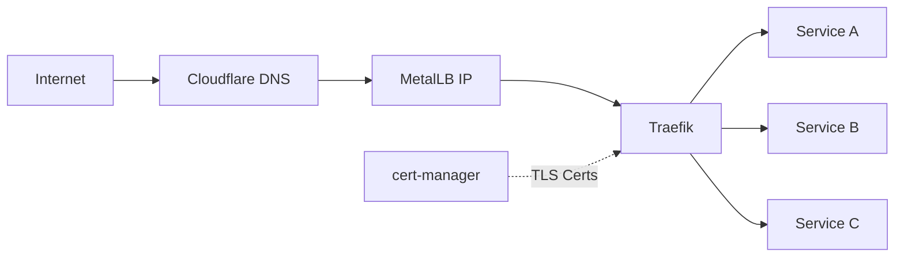
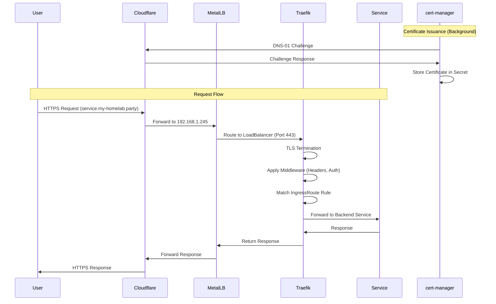

# Networking

The networking layer provides secure external access to services through ingress control,
load balancing, and automated certificate management.

## Overview

The networking architecture consists of three main components:

- **Traefik**: Reverse proxy and ingress controller
- **MetalLB**: Load balancer for external IPs
- **cert-manager**: Automatic TLS certificate management



## Traefik Configuration

[Traefik](https://traefik.io/) serves as the ingress controller and reverse proxy.

### Features

🔀 **LoadBalancer Integration**

- Static IP: 192.168.1.245
- Assigned by MetalLB
- External service exposure
- Layer 4 and Layer 7 routing

🔒 **HTTPS Redirect**

- Automatic HTTP to HTTPS redirection
- TLS termination at the edge
- Modern TLS versions (1.2+)
- Strong cipher suites

🛡️ **Security Headers**

- HSTS (HTTP Strict Transport Security)
- XSS Protection
- Content Security Policy
- X-Frame-Options
- Referrer Policy

🔑 **Authentication**

- Basic authentication support
- Forward authentication integration
- Custom middleware chains
- OAuth2 proxy ready

!!! note "Design Choice"
    Traefik was chosen for its Kubernetes-native integration, dynamic configuration, and
    robust feature set that handles both simple and complex routing scenarios.

### Deployment

Traefik is deployed as a LoadBalancer service type, receiving a static IP (192.168.1.245) from MetalLB
for external access on ports 80 and 443.

??? example "View Traefik configuration"
    --8<-- "base/infra/traefik/values.yaml"

### Middleware

Common middleware configurations include:

- **HTTPS redirect**: Automatically redirect HTTP to HTTPS with permanent redirect
- **Security headers**: Add HSTS, SSL redirect, and other security headers with appropriate timeouts

??? example "View default security headers middleware"
    --8<-- "base/infra/traefik/default-headers.yaml"

### IngressRoute Example

IngressRoute CRDs define routing rules with:

- Entry points (websecure for HTTPS)
- Host-based matching
- Service references with ports
- Middleware chains for security
- TLS certificate secret references

??? example "View IngressRoute configuration"
    --8<-- "base/infra/ingress-route.yaml"

## MetalLB Configuration

[MetalLB](https://metallb.universe.tf/) provides load balancer services in bare metal environments.

### IP Address Pool

🌐 **IP Range**: 192.168.1.240/28

- 16 assignable addresses (240-255)
- Reserved network segment
- No DHCP overlap
- Layer 2 mode (ARP)

⚖️ **Load Balancing Features**

- Address assignment
- Failover support
- Speaker daemonset
- BGP mode available (if needed)

!!! info "Network Design"
    The IP range is carefully chosen to avoid conflicts with DHCP and other network
    services while providing enough addresses for all planned services.

### Configuration

MetalLB is configured with an IPAddressPool defining available addresses and an L2Advertisement for Layer 2 mode.

??? example "View MetalLB configuration"
    --8<-- "base/infra/metallb/metallb.yaml"

## cert-manager

[cert-manager](https://cert-manager.io/) automates TLS certificate management.

### cert-manager Features

🎯 **Let's Encrypt Integration**

- Automated certificate issuance
- Automatic renewal
- ACME protocol support
- Production and staging environments

☁️ **Cloudflare DNS-01 Challenge**

- Wildcard certificate support
- DNS-based validation
- No ingress required
- Private network compatible

🌟 **Wildcard Certificates**

- `*.my-homelab.party`
- Single cert for all subdomains
- Reduced renewal frequency
- Simplified management

📊 **Monitoring**

- Prometheus metrics
- Certificate expiry alerts
- Renewal status tracking
- Error notifications

### ClusterIssuer Configuration

The ClusterIssuer configures Let's Encrypt integration with Cloudflare DNS-01 challenge solver using an API token secret.

??? example "View ClusterIssuer configuration"
    --8<-- "base/infra/cert-manager/issuers/cluster-issuer.yaml"

### Certificate Request

Certificate resources request TLS certificates from the ClusterIssuer, specifying DNS names
(including wildcards) and the target secret name.

??? example "View Certificate configuration"
    --8<-- "base/infra/cert-manager/certificates/certificate.yaml"

### DNS Configuration

### Cloudflare Setup

#### DNS Security and Management

- DDoS protection
- WAF capabilities
- Proxy protection (orange cloud)
- Analytics and insights

#### DNS Records

Configure an A record for the root domain pointing to your external IP and a CNAME wildcard record
pointing to the root, both with Cloudflare proxy enabled.

### Local DNS

For internal-only access, add entries to `/etc/hosts` or your local DNS server mapping service hostnames
to the MetalLB IP (192.168.1.245).

### Traffic Flow



## Network Policies

Kubernetes NetworkPolicies control traffic between pods.

!!! info "Current Implementation"
    NetworkPolicies are currently implemented for the ArgoCD namespace to secure GitOps operations.
    Application namespaces (htpc, utils, infra) rely on namespace isolation and do not have
    explicit NetworkPolicy resources defined.

### ArgoCD Network Policies

ArgoCD uses NetworkPolicies to:

- Control ingress traffic to ArgoCD components
- Restrict inter-component communication
- Allow specific access from Traefik ingress
- Implement least-privilege network access

### Future Considerations

Additional NetworkPolicies can be implemented for:

- Default deny policies per namespace
- Explicit allow rules for service-to-service communication
- Egress filtering for external API access

## Troubleshooting

### Traefik Issues

```bash
# Check Traefik pods
kubectl get pods -n infra -l app.kubernetes.io/name=traefik

# View Traefik logs
kubectl logs -n infra -l app.kubernetes.io/name=traefik

# Check IngressRoutes
kubectl get ingressroute -A

# Describe specific route
kubectl describe ingressroute <name> -n <namespace>
```

### MetalLB Issues

```bash
# Check speaker pods
kubectl get pods -n infra -l app=metallb

# View speaker logs
kubectl logs -n infra -l component=speaker

# Check IP address pools
kubectl get ipaddresspool -n infra

# Check L2 advertisements
kubectl get l2advertisement -n infra
```

### cert-manager Issues

```bash
# Check cert-manager pods
kubectl get pods -n infra -l app=cert-manager

# View cert-manager logs
kubectl logs -n infra -l app=cert-manager

# Check certificates
kubectl get certificate -A

# Check certificate requests
kubectl get certificaterequest -A

# Describe certificate
kubectl describe certificate <name> -n <namespace>
```

## Related Documentation

- [Security](security.md) - Security architecture
- [Kubernetes Infrastructure](kubernetes-infrastructure.md) - Cluster details
- [Observability](observability.md) - Monitoring networking
