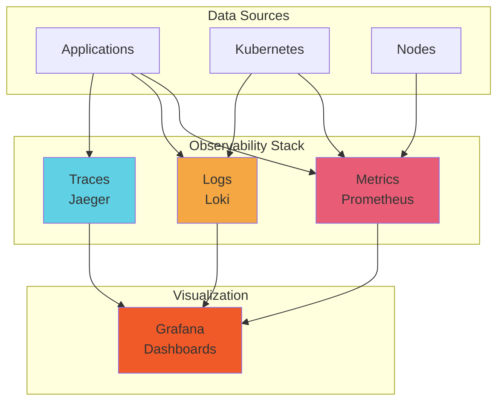
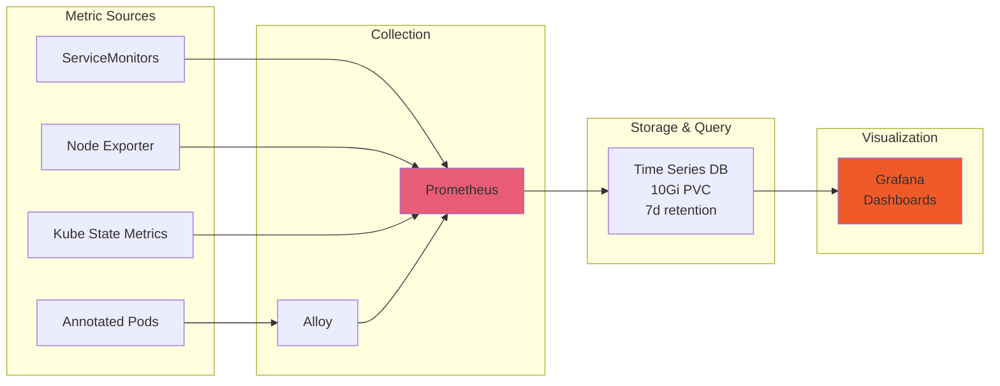
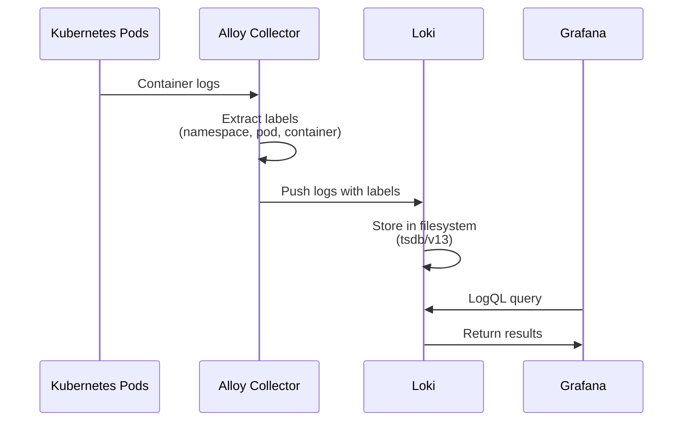

# Observability Architecture

The observability system provides comprehensive visibility into system behavior through metrics, logs, and distributed tracing.

## Three Pillars of Observability

The monitoring system is built on three foundational pillars:



### 1. Metrics (Prometheus)

Time-series data for performance and health monitoring

### 2. Logs (Loki)

Centralized logging for debugging and audit trails

### 3. Traces (Jaeger)

Distributed request tracing for performance analysis

!!! note "Observability Philosophy"
    Complete system visibility with correlation across metrics, logs, and traces enables
    rapid problem identification and resolution.

## Metrics Collection

### Prometheus Stack

[Prometheus](https://prometheus.io/) collects and stores time-series metrics.



??? example "View kube-prometheus-stack Configuration"
    ```yaml
    --8<-- "base/infra/monitoring/values-kube-prometheus-stack.yaml"
    ```

#### Components

| Component | Purpose | Key Metrics |
| --------- | ------- | ----------- |
| Prometheus | Time-series DB | - Resource utilization<br>- Application metrics<br>- Service health |
| Scraparr | Media Stats | - Download status<br>- Queue metrics<br>- Quality stats<br>- Arr service metrics |
| Node Exporter | System Metrics | - Hardware stats<br>- System load<br>- Network usage |
| ServiceMonitor | Service Discovery | - ArgoCD<br>- Scraparr<br>- cert-manager<br>- CNPG operator<br>- Alloy |

#### Configuration

ServiceMonitor CRDs enable automatic Prometheus scraping of services matching label selectors,
specifying scrape intervals and metric endpoints.

??? example "View ServiceMonitor Example - ArgoCD"
    ```yaml
    --8<-- "argocd/app/servicemonitor.yaml"
    ```

??? example "View ServiceMonitor Example - Scraparr"
    ```yaml
    --8<-- "base/htpc/scraparr/servicemonitor.yaml"
    ```

#### Key Metrics

##### Resource Utilization

- `container_cpu_usage_seconds_total`
- `container_memory_working_set_bytes`
- `kubelet_volume_stats_used_bytes`

##### Application Metrics

- `http_requests_total`
- `http_request_duration_seconds`
- `http_errors_total`

##### Service Health

- `up` - Service availability
- `probe_success` - Health check status
- `kube_pod_status_phase`

## Log Management

### Loki Stack

[Loki](https://grafana.com/oss/loki/) provides efficient log aggregation.



??? example "View Loki Configuration"
    ```yaml
    --8<-- "base/infra/monitoring/values-loki.yaml"
    ```

??? example "View Alloy Configuration"
    ```yaml
    --8<-- "base/infra/monitoring/values-alloy.yaml"
    ```

#### Loki Components

| Component | Role | Features |
| --------- | ---------------- | --------------------------------------------------------------------------- |
| Loki | Log Aggregation | - Label-based queries<br>- Log correlation<br>- Real-time tailing |
| Alloy | Log Collection | - Service discovery<br>- Label extraction<br>- Pipeline processing |

#### Log Collection

Alloy (formerly Promtail) collects logs using Kubernetes service discovery, extracting pod metadata
as labels for efficient querying in Loki.

#### Log Queries

Loki uses LogQL for querying:

- Filter logs by namespace, pod, or other labels
- Search for specific text patterns (errors, warnings)
- Aggregate log counts over time windows

## Distributed Tracing

### Jaeger

[Jaeger](https://www.jaegertracing.io/) provides distributed request tracing.

??? example "View Jaeger Configuration"
    ```yaml
    --8<-- "base/infra/monitoring/values-jaeger.yaml"
    ```

#### Capabilities

| Component | Purpose         | Capabilities                                                              |
|-----------|-----------------|---------------------------------------------------------------------------|
| Jaeger    | Request Tracing | - Latency analysis<br>- Error tracking<br>- Dependency mapping            |

#### Trace Data

Captured information:

- Request flow across services
- Latency at each step
- Error locations
- Service dependencies

#### Integration

Instrument applications using OpenTelemetry SDK, configuring the OTLP endpoint to send traces to Jaeger collector.

## Visualization & Alerting

### Grafana Dashboards

Pre-configured dashboards for comprehensive monitoring:

| Dashboard | Focus | Features |
| --------- | ----- | -------- |
| ArgoCD | GitOps Operations | - Application sync status<br>- Deployment health<br>- API activity |
| cert-manager | Certificate Management | - Certificate expiry<br>- Renewal status<br>- Issuer health |
| Kubernetes | Cluster Health | - Resource usage<br>- Node status<br>- Pod metrics |
| Loki | Log Aggregation | - Log volume<br>- Error rates<br>- Query performance |
| Scraparr | Media Automation | - Service health<br>- Request metrics<br>- Error tracking |
| HTPC | Media Services | - Arr stack metrics<br>- Download progress<br>- Resource usage |

!!! info "Dashboard Sources"
    Dashboard definitions are stored as ConfigMaps in `base/infra/monitoring/*-dashboard-cm.yaml` files
    and are automatically provisioned into Grafana via sidecar containers.

### Dashboard Access

Access Grafana via port-forward:

```bash
kubectl port-forward -n infra svc/grafana 3000:80
```

Then visit `http://localhost:3000` with default credentials `admin`/`admin` (change on first login).

### Custom Dashboards

Create custom dashboards using:

- PromQL for metrics
- LogQL for logs
- Template variables
- Panel plugins

## Alerting

### Alert Rules

!!! example "PrometheusRule Template"
    Alert rules can be defined using PrometheusRule CRDs. Below is a template example:

    ```yaml
    apiVersion: monitoring.coreos.com/v1
    kind: PrometheusRule
    metadata:
    name: app-alerts
    namespace: infra
    spec:
    groups:
        - name: app
        interval: 30s
        rules:
            - alert: HighErrorRate
            expr: |
                rate(http_errors_total[5m]) > 0.05
            for: 5m
            labels:
                severity: warning
            annotations:
                summary: "High error rate detected"
                description: "Error rate is {{ $value }} errors/sec"
    ```

!!! note "Current Alert Configuration"
    Alert rules are currently managed through the kube-prometheus-stack default rules.
    Custom PrometheusRule resources can be added as needed following the template above.

### Alert Configuration

!!! info "Alertmanager Setup"
    Alertmanager is deployed and ready for configuration. Alert routing and notification channels
    can be configured by updating the Alertmanager configuration.

    Supported notification channels include:

    - **Slack**: Real-time notifications
    - **Email**: Detailed alert information
    - **PagerDuty**: On-call escalation
    - **Webhook**: Custom integrations

### Alert Severity Levels

- **Critical**: Immediate action required
- **Warning**: Attention needed soon
- **Info**: Informational only

## Monitoring Best Practices

### Metrics

- **Use labels wisely**: Avoid high cardinality
- **Set appropriate intervals**: Balance accuracy and load
- **Monitor what matters**: Focus on business metrics
- **Set SLOs**: Define service level objectives

### Logs

- **Structured logging**: Use JSON format
- **Consistent labels**: Standardize label names
- **Appropriate levels**: Use correct log levels
- **Sampling**: Sample high-volume logs

### Traces

- **Sample strategically**: 100% for errors, sample successes
- **Tag appropriately**: Add meaningful tags
- **Monitor overhead**: Keep instrumentation lightweight
- **Correlate with logs**: Link traces to log entries

## Performance Optimization

### Prometheus

Key configuration parameters:

- **Retention**: 7 days time-based
- **Storage**: 10Gi persistent volume
- **Resources**: 256Mi-768Mi memory, 150m-400m CPU
- Configuration can be adjusted based on metric cardinality and query load

### Loki

Optimize log ingestion and storage:

- **Deployment mode**: SingleBinary
- **Storage**: 4Gi persistent volume with local-path-infra storage class
- **Resources**: 200Mi-700Mi memory, 100m-300m CPU
- **Storage backend**: Filesystem (tsdb with v13 schema)
- Retention policies can be configured based on storage capacity

### Jaeger Configuration

Jaeger deployment configuration:

- **Deployment mode**: All-in-One
- **Storage backend**: Badger (embedded database)
- **Storage**: 10Gi persistent volume
- **Resources**: 256Mi-768Mi memory, 100m-300m CPU
- Sampling configuration can be adjusted at the application level using OpenTelemetry SDK

## Data Retention

| Component | Current Retention | Storage | Configurable |
| ----------- | ------------------- | ----------- | -------------- |
| Prometheus | 7 days | 10Gi PVC | Yes |
| Loki | Volume-based | 4Gi PVC | Yes |
| Jaeger | Storage-based | 10Gi PVC | Yes |
| Grafana | Unlimited | Existing PVC | N/A |

## Troubleshooting

### Prometheus Issues

```bash
# Check Prometheus pods
kubectl get pods -n infra -l app.kubernetes.io/name=prometheus

# View Prometheus logs
kubectl logs -n infra -l app.kubernetes.io/name=prometheus

# Check targets
kubectl port-forward -n infra svc/kube-prometheus-stack-prometheus 9090:9090
# Visit http://localhost:9090/targets

# Check service monitors
kubectl get servicemonitor -A
```

### Loki Issues

```bash
# Check Loki pods
kubectl get pods -n infra -l app.kubernetes.io/name=loki

# View Loki logs
kubectl logs -n infra -l app.kubernetes.io/name=loki

# Test log query
kubectl port-forward -n infra svc/loki 3100:3100
curl -G -s "http://localhost:3100/loki/api/v1/query" \
  --data-urlencode 'query={namespace="utils"}'
```

### Grafana Issues

```bash
# Check Grafana pods
kubectl get pods -n infra -l app.kubernetes.io/name=grafana

# View Grafana logs
kubectl logs -n infra -l app.kubernetes.io/name=grafana

# Reset admin password
kubectl exec -n infra $(kubectl get pod -n infra -l app.kubernetes.io/name=grafana \
  -o jsonpath='{.items[0].metadata.name}') -- grafana-cli admin reset-admin-password newpassword
```

### Jaeger Issues

```bash
# Check Jaeger pods (all-in-one deployment)
kubectl get pods -n infra -l app.kubernetes.io/name=jaeger

# View Jaeger logs
kubectl logs -n infra -l app.kubernetes.io/name=jaeger

# Access Jaeger UI
kubectl port-forward -n infra svc/jaeger-query 16686:16686
# Visit http://localhost:16686
```

## Monitoring Checklist

Regular monitoring health checks:

- [ ] All monitoring pods are running
- [ ] Prometheus targets are up
- [ ] Logs are being ingested
- [ ] Dashboards are loading
- [ ] Alerts are configured
- [ ] Alert channels are working
- [ ] Retention policies are set
- [ ] Storage is not full
- [ ] Performance is acceptable

## Related Documentation

- [Kubernetes Infrastructure](kubernetes-infrastructure.md) - Cluster monitoring
- [Networking](networking.md) - Network metrics
- [Services](../services/observability-stack.md) - Observability services
