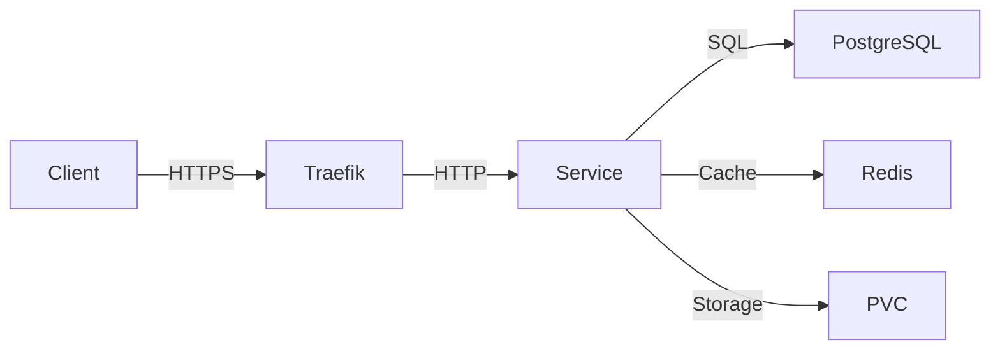
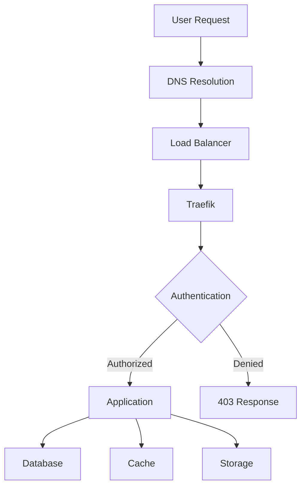

# Architecture Overview

The homelab platform employs a modern microservices architecture, with each component
running as a Kubernetes service. This design provides flexibility, scalability, and
maintainability while following cloud-native best practices.

## System Design


## Design Philosophy

!!! quote "Architecture Principles"
    This setup embraces the Infrastructure as Code (IaC) paradigm, using declarative
    configurations to ensure reproducibility and maintainability. The architecture follows
    cloud-native principles while being optimized for home deployment.

### Core Principles

#### Microservices Architecture

Each service is independently deployable and scalable, with clear boundaries and responsibilities.

#### Declarative Configuration

All infrastructure is defined in version-controlled YAML files, ensuring consistency and reproducibility.

#### GitOps Workflow

Changes flow through Git, with automated synchronization to maintain desired state.

#### Defense in Depth

Multiple security layers protect services and data at every level.

## High-Level Architecture

### Layer Breakdown

The platform consists of several distinct layers, each serving a specific purpose:

#### 1. External Access Layer

- **DNS Management**: Cloudflare provides DNS resolution and DDoS protection
- **Certificate Authority**: Let's Encrypt issues TLS certificates
- **Edge Security**: Cloudflare WAF and proxy protection

#### 2. Ingress Layer

- **Load Balancing**: MetalLB assigns external IPs to services
- **Reverse Proxy**: Traefik routes traffic to appropriate services
- **TLS Termination**: Automatic HTTPS with cert-manager
- **Authentication**: Middleware for access control

#### 3. Application Layer

- **Core Infrastructure**: ArgoCD, monitoring, storage provisioners
- **Personal Cloud**: Nextcloud, Immich, Tandoor
- **Media Services**: Complete media automation stack
- **Utility Services**: Homepage dashboard, databases

#### 4. Data Layer

- **Relational Database**: CloudNativePG for PostgreSQL
- **Caching**: Redis for Nextcloud caching, Valkey for Immich caching
- **Persistent Storage**: Local-path-provisioner for volumes

#### 5. Observability Layer

- **Metrics**: Prometheus collects and stores time-series data
- **Visualization**: Grafana displays dashboards and alerts
- **Logging**: Loki aggregates logs from all services
- **Tracing**: Jaeger tracks distributed requests

## Architecture Characteristics

### Scalability

The architecture supports both vertical and horizontal scaling:

- **Vertical**: Increase resource allocations per service
- **Horizontal**: Add more replicas for high-availability

### Reliability

Multiple mechanisms ensure system reliability:

- **Health Checks**: Kubernetes liveness and readiness probes
- **Self-Healing**: Automatic restart of failed containers
- **Rolling Updates**: Zero-downtime deployments
- **Rollback Capability**: Quick reversion to previous versions

### Maintainability

The system is designed for easy maintenance:

- **Modular Design**: Independent service updates
- **Clear Separation**: Namespace isolation
- **Automated Updates**: Renovate Bot for dependencies
- **Documentation**: Inline comments and external docs

### Security

Security is embedded at every layer:

- **Network Policies**: Control traffic between services
- **Secret Management**: Encrypted storage of sensitive data
- **TLS Everywhere**: End-to-end encryption
- **RBAC**: Role-based access control

## Component Interaction

### Service Communication

Services communicate through well-defined interfaces:



### Data Flow

Data flows through the system in a controlled manner:



## Deployment Model

### Environment Separation

The platform supports multiple environments:

- **Staging**: Testing and development
- **Production**: Live services

Each environment has:

- Separate namespaces
- Independent configurations
- Isolated resources

### Configuration Management

Configurations are managed through Kustomize:

```text
base/
├── htpc/
├── infra/
└── utils/

overlays/
├── staging-infra/
├── staging-ingress/
├── production-infra/
└── production-ingress/
```

## Architectural Decisions

### Why k3s?

k3s was chosen for its:

- **Lightweight footprint**: Minimal resource overhead
- **Single binary**: Easy installation and updates
- **Built-in components**: Traefik, local-path-provisioner included
- **Production-ready**: CNCF certified Kubernetes

### Why ArgoCD?

ArgoCD provides:

- **GitOps workflow**: Git as single source of truth
- **Automated sync**: Continuous deployment
- **Drift detection**: Alerts when cluster state diverges
- **Rollback capability**: Easy reversion to previous states

### Why Kustomize?

Kustomize offers:

- **Native Kubernetes**: Built into kubectl
- **No templating**: Pure YAML with overlays
- **Composability**: Layer configurations easily
- **Simplicity**: Easy to understand and maintain

## Design Patterns

### 12-Factor App Principles

The platform follows the [12-Factor App](https://12factor.net/) methodology:

1. **Codebase**: One codebase in version control
2. **Dependencies**: Explicitly declared
3. **Config**: Stored in environment
4. **Backing services**: Attached resources
5. **Build, release, run**: Strict separation
6. **Processes**: Stateless execution
7. **Port binding**: Self-contained services
8. **Concurrency**: Scale out via process model
9. **Disposability**: Fast startup and graceful shutdown
10. **Dev/prod parity**: Keep environments similar
11. **Logs**: Treat logs as event streams
12. **Admin processes**: Run as one-off processes

### Service Mesh Ready

The architecture can be extended with a service mesh:

- **Istio**: For advanced traffic management
- **Linkerd**: For simplicity and performance
- **Consul**: For service discovery

Currently, basic service-to-service communication is sufficient, but the design allows for future mesh integration.

## Operational Considerations

### Resource Management

Resources are allocated per namespace:

- **Resource Quotas**: Limit total resource consumption
- **Limit Ranges**: Set default and max limits
- **Priority Classes**: Ensure critical services get resources

### Backup Strategy

Data protection through:

- **Git repository**: Configuration backups
- **Persistent volume snapshots**: Data backups
- **Database dumps**: Regular SQL exports

### Disaster Recovery

Recovery procedures:

1. **Configuration**: Restore from Git
2. **Data**: Restore from volume snapshots
3. **Redeploy**: Run kickstart script
4. **Verify**: Check application health

## Future Enhancements

Potential architectural improvements:

- **Multi-cluster**: Expand to multiple clusters
- **Service mesh**: Advanced traffic management
- **External secrets**: HashiCorp Vault integration
- **Automated backups**: Velero for disaster recovery
- **Edge computing**: Deploy edge nodes for local processing

## Related Documentation

- [Kubernetes Infrastructure](kubernetes-infrastructure.md) - Cluster details
- [Networking](networking.md) - Ingress and routing
- [Storage](storage.md) - Persistent storage
- [Security](security.md) - Security architecture
