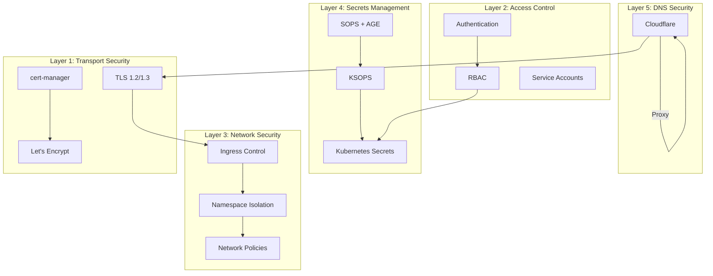

# Security Architecture

The security framework is built on multiple layers of protection, implementing
defense-in-depth principles to protect services and data.

## Security Philosophy

!!! quote "Defense in Depth"
    Security is implemented at every layer of the stack, with multiple overlapping controls
    working together to protect services and data. No single point of failure compromises the
    entire system.

### Security Architecture Overview



## Security Layers

The platform implements security at five distinct layers:

### 1. Transport Security

#### SSL/TLS Implementation

🛡️ **Automated Certificate Management**

- Let's Encrypt integration via cert-manager
- Automatic certificate renewal
- Wildcard certificates for all subdomains
- DNS-01 challenge for validation

🔒 **Modern TLS Configuration**

- TLS 1.2 and 1.3 only
- Strong cipher suites
- Perfect Forward Secrecy (PFS)
- OCSP stapling

#### Configuration Example

TLS options are configured via Traefik TLSOption CRDs specifying minimum TLS version,
allowed cipher suites, and curve preferences. Security headers are enforced through Traefik middleware.

??? example "View security headers configuration"
    --8<-- "base/infra/traefik/default-headers.yaml"

### 2. Access Control

#### Authentication Strategy

🔑 **Multi-Factor Capability**

- Support for 2FA/MFA where available
- OAuth2 integration ready
- LDAP/SSO integration possible

👤 **Role-Based Access Control (RBAC)**

- Kubernetes RBAC for cluster access
- Application-level permissions
- Least privilege principle
- Service accounts with limited scope

!!! example "RBAC Implementation"
    RBAC is implemented for specific services like cert-manager, ArgoCD, and homepage that require
    cluster API access. See `base/infra/cert-manager/role.yaml` and related RBAC files.

🛡️ **Session Management**

- Secure session cookies
- Session timeout policies
- Session invalidation on logout

🚫 **Brute Force Protection**

- Rate limiting middleware
- Account lockout policies
- IP-based blocking

### 3. Network Security

#### Network Policies

🌐 **Namespace Isolation**

Namespace-level isolation provides the primary network boundary. NetworkPolicies are implemented
for ArgoCD to control inter-component communication.

🔗 **Inter-Service Communication Control**

Services communicate within namespaces using Kubernetes DNS. Cross-namespace communication
is controlled through service exposure and ingress rules.

🔒 **Egress Traffic Filtering**

- Services access external APIs as needed
- Cloudflare provides edge-level filtering
- Future: Implement explicit egress policies

#### Pod Security Standards

!!! note "Implementation Status"
    Pod Security Standards can be enforced at the namespace level using labels. Current implementation
    focuses on container-level security contexts (fsGroup, supplementalGroups) for file access control,
    particularly for media services and databases.

### 4. Secrets Management

#### Secure Configuration

🤫 **Encrypted Secrets Storage**

- **SOPS with AGE encryption**: Secrets encrypted in Git
- **KSOPS**: Kustomize integration for automatic decryption
- **Kubernetes Secrets**: Runtime secrets in cluster
- **Encryption at rest**: etcd encryption for cluster secrets

🔐 **Runtime Injection**

- Secrets mounted as volumes or environment variables
- SOPS decryption during kustomize build
- No plaintext secrets in Git repository

♻️ **Rotation Policies**

- Cloudflare API token for cert-manager
- AGE encryption keys for SOPS
- Manual rotation process with secret updates

🔑 **Least Privilege Principle**

- Secrets scoped to namespaces
- ServiceAccount token projection
- Minimal secret exposure through RBAC

#### Secret Example

Secrets are encrypted using SOPS before committing to Git. The CI/CD pipeline uses AGE keys to decrypt
secrets during validation and deployment.

??? example "View SOPS configuration"
    See `.sops.yaml` in repository root for encryption rules.

### 5. DNS Security

#### Cloudflare Integration

☁️ **DDoS Protection**

- Automatic DDoS mitigation
- Rate limiting at edge
- Traffic filtering

🛡️ **WAF Capabilities**

- Web Application Firewall rules
- OWASP top 10 protection
- Custom rule creation

🔒 **DNS-Based Authentication**

- DNS-01 ACME challenges
- Secure certificate issuance
- Private network compatible

🌐 **Proxy Protection**

- Hide origin IP address
- SSL/TLS termination at edge
- Bot protection

## Security Monitoring

### Audit Logging

Kubernetes audit logs track all API server access, recording who did what and when. Configure audit policies
to capture metadata-level information for sensitive resources like secrets while minimizing storage overhead.

### Intrusion Detection

Monitor for suspicious activity:

- Failed authentication attempts
- Unusual API access patterns
- Privilege escalation attempts
- Resource abuse

### Vulnerability Scanning

Approaches for vulnerability management:

- **Dependencies**: Renovate Bot for automated updates
- **Secret detection**: TruffleHog in CI pipeline

## Security Best Practices

### Container Security

- **Security contexts**: Used for filesystem permissions (fsGroup, supplementalGroups)
- **Minimal base images**: Use official images from trusted sources
- **Resource limits**: CPU and memory limits defined per container
- **Image updates**: Automated via Renovate Bot

!!! example "Actual Implementation"
    Most services use `securityContext` with `fsGroup` (typically 1000) for volume access:
        ```yaml
        securityContext:
        fsGroup: 1000
        ```

    Some services like Jellyfin require privileged mode for hardware access (GPU transcoding):
        ```yaml
        securityContext:
        privileged: true
        ```

### Network Security

- **TLS everywhere**: All external and internal traffic
- **Network segmentation**: Use NetworkPolicies
- **Ingress filtering**: Only expose necessary services
- **Egress control**: Limit outbound connections

### Access Control

- **Principle of least privilege**: Minimal permissions
- **Regular audits**: Review access permissions
- **MFA enforcement**: Enable where supported
- **Password policies**: Strong passwords, rotation

### Data Protection

- **Encryption at rest**: Disk encryption (LUKS)
- **Encryption in transit**: TLS for all communication
- **Backup encryption**: Encrypted backups
- **Data minimization**: Only store necessary data

## Compliance Considerations

### Data Privacy

- **GDPR considerations**: Data subject rights
- **Data location**: Know where data is stored
- **Data retention**: Implement retention policies
- **Audit trails**: Track data access

### Security Standards

- **CIS Kubernetes Benchmark**: Follow hardening guidelines
- **NIST Framework**: Align with cybersecurity framework
- **ISO 27001**: Information security management

## Incident Response

### Detection

- Automated alerting on security events
- Log aggregation and analysis
- Anomaly detection

### Response

1. **Identify**: Determine scope and impact
2. **Contain**: Isolate affected systems
3. **Eradicate**: Remove threat
4. **Recover**: Restore to normal operations
5. **Learn**: Post-incident analysis

### Recovery

- Backup restoration procedures
- Service priority matrix
- Communication plans

## Security Checklist

Regular security review checklist:

- [ ] All services use TLS
- [ ] Certificates are valid and not expiring
- [ ] NetworkPolicies are in place
- [ ] RBAC is properly configured
- [ ] Secrets are encrypted and rotated
- [ ] Container images are up-to-date
- [ ] Vulnerability scans are clean
- [ ] Audit logs are being collected
- [ ] Backups are encrypted and tested
- [ ] Access controls are reviewed

## Troubleshooting

### Certificate Issues

```bash
# Check certificate status
kubectl get certificate -A

# Describe certificate
kubectl describe certificate <name> -n <namespace>

# Check cert-manager logs
kubectl logs -n infra -l app=cert-manager
```

### Authentication Problems

```bash
# Check RBAC permissions
kubectl auth can-i <verb> <resource> --as=<user>

# List roles and rolebindings
kubectl get roles,rolebindings -n <namespace>

# Describe specific role
kubectl describe role <name> -n <namespace>
```

### Network Policy Issues

```bash
# Test connectivity
kubectl exec -it <pod> -n <namespace> -- curl <service>

# Check network policies
kubectl get networkpolicy -n <namespace>

# Describe policy
kubectl describe networkpolicy <name> -n <namespace>
```

## Related Documentation

- [Networking](networking.md) - Network architecture
- [Configuration: Secrets](../configuration/secrets.md) - Secret management
- [Observability](observability.md) - Security monitoring
