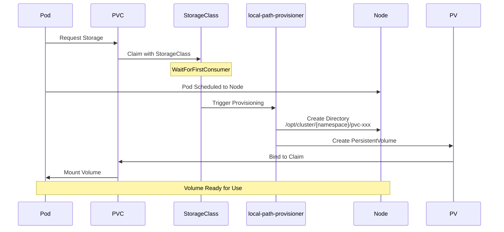

# Storage Architecture

The storage architecture provides persistent data storage for applications with dynamic
provisioning, namespace isolation, and performance optimization.

## Storage Principles

The storage design follows these core principles:

### Dynamic Provisioning

- Automated volume management
- Just-in-time resource allocation
- Flexible capacity planning
- No manual PV creation

### Namespace Isolation

- Dedicated StorageClasses per namespace
- Independent scaling capabilities
- Granular access control
- Resource quota enforcement

### Performance Optimization

- Local path provisioning for low latency
- Direct volume access
- Optimized for media streaming
- Fast random access for databases

!!! note "Storage Design"
    The storage architecture prioritizes performance and reliability while maintaining flexibility for future growth.

## Local Path Provisioner

The platform uses [local-path-provisioner](https://github.com/rancher/local-path-provisioner) for dynamic storage.

### Features

- **Dynamic PV creation**: Automatic volume provisioning
- **Local storage**: Uses host filesystem
- **Low latency**: Direct disk access
- **Simple configuration**: No external dependencies

### Configuration

The platform uses namespace-specific StorageClasses, each provisioning volumes to dedicated directories.

??? example "View StorageClass configuration"
    --8<-- "base/infra/local-path-provisioner/storageclass.yaml"

!!! info "Reclaim Policy"
    StorageClasses use `Retain` reclaim policy to prevent accidental data loss. Volumes must be
    manually deleted from the host filesystem after PVC deletion.

### Storage Location

Storage is organized by namespace:

- **Infrastructure**: `/opt/cluster/infra`
- **Media (HTPC)**: `/opt/cluster/htpc`
- **Utilities**: `/opt/cluster/utils`

```bash
# Create storage directories
sudo mkdir -p /opt/cluster/{infra,htpc,utils}
sudo chmod 755 /opt/cluster

# Check storage usage by namespace
du -sh /opt/cluster/*
```

## Persistent Volume Claims

### Infrastructure Namespace (infra)

| PVC | Size | Purpose | Design Considerations |
| --- | ---- | ------- | --------------------- |
| grafana-data-pvc | 5Gi | Dashboard storage | Fast random access, low latency |
| jaeger-data-pvc | 10Gi | Trace storage | High write frequency, sequential access |
| traefik-data-pvc | 1Gi | Traefik storage | Configuration and cache |
| alloy-data-pvc | 5Gi | Alloy storage | Metrics and logs buffering |

??? example "View infrastructure PVCs"
    --8<-- "base/infra/persistent-volume-claim.yaml"

### Utilities Namespace (utils)

| PVC | Size | Purpose | Design Considerations |
| --- | ---- | ------- | --------------------- |
| immich-library-pvc | 20Gi | Photos/Videos | Mixed IO patterns, large files |
| immich-valkey-pvc | 5Gi | Cache data | In-memory performance, persistence |
| immich-ml-cache-pvc | 10Gi | ML Models | Read-optimized, infrequent writes |
| nextcloud-pvc | 31Gi | File storage | Mixed workload, many small files |
| nextcloud-redis-pvc | 1Gi | Redis cache | Fast access, persistence |
| tandoor-data-pvc | 20Gi | Recipe data | Small files, frequent access |

??? example "View utilities PVCs"
    --8<-- "base/utils/persistent-volume-claim.yaml"

### Media Namespace (htpc)

| PVC | Size | Purpose | Design Considerations |
| --- | ---- | ------- | --------------------- |
| htpc-pvc | 500Gi | Media & App Data | High throughput, large sequential files |

??? example "View HTPC PVC"
    --8<-- "base/htpc/persistent-volume-claim.yaml"

!!! info "Dynamic Provisioning"
    All storage is dynamically provisioned by local-path-provisioner. No manual PV creation required.

### Storage Provisioning Flow



## Storage Performance

### Media Streaming

Optimized for high-throughput sequential access:

- **Large block sizes**: 1MB+ for video files
- **Read-ahead**: Kernel buffer tuning
- **Direct I/O**: Bypass page cache when appropriate

### Database Storage

Optimized for random access and IOPS:

- **Small block sizes**: 4KB-16KB
- **SSD recommended**: Fast random reads/writes
- **fsync behavior**: WAL for PostgreSQL

### Cache Storage

Optimized for fast access:

- **tmpfs option**: In-memory storage
- **SSD preferred**: Low latency
- **Persistence**: Optional depending on use case

## Volume Snapshots

### VolumeSnapshot Support

If using a CSI driver with snapshot support, VolumeSnapshot resources can create point-in-time copies of PVCs.

### Backup Strategy

For manual backups, use kubectl exec to tar data from pods and extract when restoring.

## Storage Monitoring

### Capacity Tracking

```bash
# Check PV usage
kubectl get pv

# Check PVC usage
kubectl get pvc -A

# Describe PVC for details
kubectl describe pvc <name> -n <namespace>

# Check actual disk usage by namespace
du -sh /opt/cluster/*
```

### Metrics Collection

Prometheus metrics for storage:

- **kubelet_volume_stats_capacity_bytes**: Total capacity
- **kubelet_volume_stats_used_bytes**: Used space
- **kubelet_volume_stats_available_bytes**: Available space
- **kubelet_volume_stats_inodes**: Inode usage

### Grafana Dashboards

Pre-configured dashboards show:

- Storage utilization per namespace
- PVC growth over time
- I/O performance metrics
- Capacity forecasting

## Storage Expansion

### Expanding PVCs

!!! warning "Manual Expansion Required"
    With `Retain` reclaim policy and local-path provisioner, PVC expansion requires manual steps:

    1. Delete the pod using the PVC
    2. Edit the PVC to increase size
    3. Manually expand the filesystem on the node
    4. Restart the pod

```bash
# Edit PVC to increase size
kubectl edit pvc <name> -n <namespace>

# Or patch directly
kubectl patch pvc <name> -n <namespace> -p '{"spec":{"resources":{"requests":{"storage":"20Gi"}}}}'
```

### Adding Storage Nodes

For multi-node clusters:

1. Add storage to new node
2. Label node for storage workloads
3. Update storage class topology
4. Migrate workloads if needed

## Data Migration

### Moving Between PVCs

```bash
# Method 1: Using a temporary pod
kubectl run -i --tty migrator --image=busybox --restart=Never -- sh
# Mount both PVCs and copy data

# Method 2: Using kubectl cp
kubectl cp source-pod:/data ./local-data -n namespace
kubectl cp ./local-data dest-pod:/data -n namespace
```

### External Storage Integration

To integrate external storage:

- **NFS**: Mount network shares
- **Ceph**: Use Rook operator
- **iSCSI**: Configure CSI driver
- **Cloud**: Use cloud provider CSI

## Storage Best Practices

### Planning

- **Estimate growth**: Plan for 2-3x current usage
- **Separate workloads**: Different storage for different needs
- **Monitor trends**: Track usage patterns

### Performance

- **SSD for databases**: Use fast storage for DB workloads
- **HDD for media**: Cost-effective for sequential access
- **Cache layer**: Use Redis/Valkey for frequently accessed data

### Reliability

- **Regular backups**: Automate backup processes
- **Test restores**: Verify backup integrity
- **RAID arrays**: Use hardware RAID for redundancy
- **Multiple disks**: Spread risk across devices

### Security

- **Encryption at rest**: Use disk encryption (LUKS)
- **Access controls**: RBAC for PVC access
- **Quotas**: Prevent storage exhaustion
- **Audit logs**: Track storage access

## Troubleshooting

### PVC Stuck in Pending

```bash
# Check PVC events
kubectl describe pvc <name> -n <namespace>

# Check storage class
kubectl get storageclass

# Check provisioner logs
kubectl logs -n kube-system -l app=local-path-provisioner
```

### Volume Mount Errors

```bash
# Check pod events
kubectl describe pod <name> -n <namespace>

# Check volume status
kubectl get pv <pv-name>

# Check node capacity
kubectl describe node <node-name>
```

### Performance Issues

```bash
# Check I/O stats
kubectl top pods -n <namespace>

# Check node I/O
iostat -x 1

# Check disk space by namespace
df -h /opt/cluster
du -sh /opt/cluster/*
```

## Related Documentation

- [Kubernetes Infrastructure](kubernetes-infrastructure.md) - Cluster configuration
- [Reference: Storage Reference](../reference/storage-reference.md) - Detailed specs
- [Services](../services/index.md) - Service storage requirements
