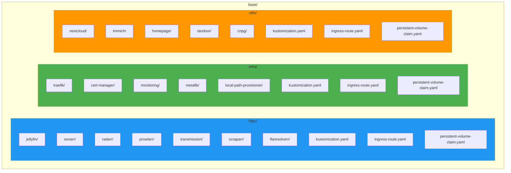
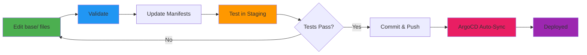

# Base Configurations

Base configurations contain common settings shared across all environments.



## Directory Structure

The base directory is organized into three main namespaces (htpc, infra, utils), each containing service
subdirectories and shared resource files for ingress routes and persistent volume claims.

## Service Structure

Each service typically includes standard Kubernetes resources:

- **Deployment**: Application container specifications
- **Service**: ClusterIP service for internal communication
- **Kustomization**: Lists the service's resource manifests
- **ConfigMap** (optional): Non-sensitive configuration data
- **Secret** (optional): Sensitive credentials and keys
- **Ingress Route**: Added to namespace-level ingress-route.yaml if external access needed
- **Persistent Volume Claim**: Added to namespace-level PVC file if storage needed

### Simple Service Example

Most services follow a simple pattern with deployment, service, and kustomization:

??? example "Jellyfin Service Structure"
    ```bash
    base/htpc/jellyfin/
    ├── deployment.yaml
    ├── service.yaml
    └── kustomization.yaml
    ```

    ```yaml
    # Kustomization
    --8<-- "base/htpc/jellyfin/kustomization.yaml"
    ```

### Complex Service Example

Some services have additional resources like databases, caches, and jobs:

??? example "Nextcloud Service Structure"
    ```bash
    base/utils/nextcloud/
    ├── configmap.yaml
    ├── kustomization.yaml
    ├── middleware.yaml
    ├── nextcloud-cronjob.yaml
    ├── nextcloud-deployment.yaml
    ├── nextcloud-service.yaml
    ├── postgres-cluster.yaml
    ├── redis-deployment.yaml
    ├── redis-service.yaml
    └── secret/
    ```

    ```yaml
    # Kustomization
    --8<-- "base/utils/nextcloud/kustomization.yaml"
    ```

## Kustomization Files

### Namespace Kustomization

Namespace-level kustomization files list all service subdirectories as resources, shared resources like
ingress routes and PVCs, and common labels.

??? example "View utils kustomization.yaml"
    --8<-- "base/utils/kustomization.yaml"

### Service Kustomization

Service-level kustomization files list the service's resource manifests and apply common labels for the application.

## Common Patterns

### Deployment

Standard Kubernetes Deployments define:

- Application container specs (image, ports, environment variables)
- Replica count and pod labels
- Resource requirements (CPU, memory limits)
- Volume mounts and ConfigMap/Secret references
- Liveness and readiness probes

### Service

Services expose applications internally with:

- Selector labels to identify target pods
- Port mappings (service port → container targetPort)
- Service type (ClusterIP for internal, LoadBalancer for external)

### IngressRoute

Traefik IngressRoutes provide external access with:

- Entry points (websecure for HTTPS)
- Host-based routing rules
- TLS certificate references
- Middleware for headers, authentication, rate limiting

## Shared Resources

### Persistent Volume Claims

PVCs request storage with specified access modes (e.g., ReadWriteOnce), storage class (local-path), and capacity requirements.

??? example "View Utils Namespace PVCs"
    ```yaml
    --8<-- "base/utils/persistent-volume-claim.yaml"
    ```

Each namespace uses its own storage class:

- `local-path-htpc` for htpc namespace
- `local-path-infra` for infra namespace
- `local-path-utils` for utils namespace

This allows storage to be organized by namespace in the filesystem (e.g., `/opt/cluster/utils`, `/opt/cluster/htpc`).

### Ingress Routes

Shared IngressRoute files can define multiple host-based routes for services within a namespace, all using the same TLS certificate.

??? example "View HTPC Namespace IngressRoute"
    ```yaml
    --8<-- "base/htpc/ingress-route.yaml"
    ```

This single IngressRoute defines access to all HTPC services (Jellyfin, Sonarr, Radarr, etc.) with host-based routing.

## Best Practices

### Resource Management

- Set resource requests and limits
- Use appropriate QoS classes
- Plan for scaling

### Configuration

- Use ConfigMaps for non-sensitive data
- Use Secrets for sensitive data
- Externalize configuration

### Storage

- Request appropriate storage sizes
- Use namespace-specific storage classes (e.g., `local-path-htpc`, `local-path-infra`, `local-path-utils`)
- Use correct access modes (ReadWriteOnce, ReadWriteMany)
- Plan for growth

### Security

- Follow principle of least privilege
- Use RBAC for service accounts where needed
- Keep images updated
- Apply security contexts as appropriate for workloads

## Modifying Base Configurations



### Making Changes

1. Edit files in `base/` directory
2. Validate changes: `./scripts/validate.sh`
3. Build manifests: `./scripts/update-manifests.sh`
4. Test in staging first
5. Commit and push changes
6. ArgoCD will sync automatically

### Adding New Services

1. Create service directory in appropriate namespace
2. Add service manifests
3. Create kustomization.yaml
4. Add to namespace kustomization
5. Test and deploy

## Related Documentation

- [Architecture: Configuration Management](../architecture/configuration-management.md)
- [Overlays](overlays.md)
- [Secrets](secrets.md)
