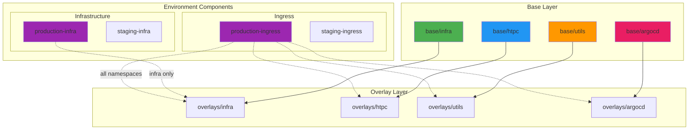
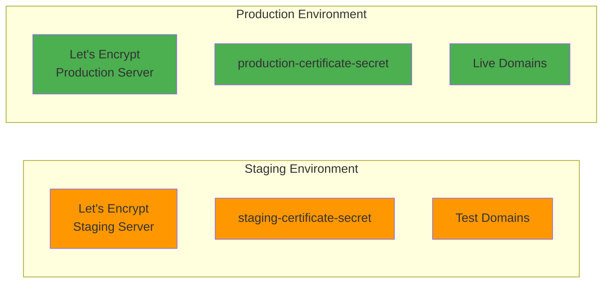

# Overlays

Overlays customize base configurations for specific environments using Kustomize patches.



## Overlay Structure

The overlays directory contains environment-specific configurations organized by namespace (argocd, htpc, infra, utils).
Each overlay references the corresponding base configuration and uses Kustomize **components** from the
`overlays/environment/` directory for environment-specific customizations (staging vs production, infrastructure
and ingress settings).

## Environment Types



### Staging

Development and testing environment with:

- Let's Encrypt staging certificates (to avoid rate limits during testing)
- Staging TLS secret names
- Separate domain configurations

### Production

Live environment with:

- Let's Encrypt production certificates
- Production TLS secret names
- Production domain configurations

## Overlay Configuration

The repository uses a component-based approach where namespace overlays reference base configurations
and include environment-specific components for infrastructure and ingress customization.

### Staging Infrastructure Component

The staging infrastructure component patches cert-manager resources to use Let's Encrypt staging server
and staging certificate secrets.

??? example "View staging-infra kustomization.yaml"
    --8<-- "overlays/environment/staging-infra/kustomization.yaml"

### Production Infrastructure Component

The production infrastructure component patches cert-manager resources to use Let's Encrypt production server
and production certificate secrets.

??? example "View production-infra kustomization.yaml"
    --8<-- "overlays/environment/production-infra/kustomization.yaml"

## Environment Components

The repository uses Kustomize **components** to apply environment-specific configurations. Components are located
in `overlays/environment/` and referenced by namespace overlays.

### Infrastructure Components

Infrastructure components (`staging-infra` and `production-infra`) patch cert-manager certificates and ClusterIssuers:

- **Staging**: Uses Let's Encrypt staging server for testing
- **Production**: Uses Let's Encrypt production server with production certificates

### Ingress Components

Ingress components (`staging-ingress` and `production-ingress`) configure environment-specific domain names
and TLS settings for IngressRoute resources.

### Customization Capabilities

While the current implementation focuses on certificate and ingress configuration, Kustomize patches can also modify:

- **Replicas**: Adjust pod counts per environment
- **Resources**: Set different CPU/memory limits
- **Images**: Override container image tags
- **ConfigMaps**: Environment-specific configuration values

## Namespace Overlays

### HTPC Overlay

The HTPC overlay configures media services with appropriate labels.

??? example "View HTPC kustomization.yaml"
    --8<-- "overlays/htpc/kustomization.yaml"

### Infrastructure Overlay

The infrastructure overlay configures core infrastructure services with production labels.

??? example "View infrastructure kustomization.yaml"
    --8<-- "overlays/infra/kustomization.yaml"

### Utils Overlay

The utils overlay configures utility services with appropriate labels.

??? example "View utils kustomization.yaml"
    --8<-- "overlays/utils/kustomization.yaml"

### ArgoCD Overlay

The ArgoCD overlay includes both application definitions and CRDs.

??? example "View ArgoCD kustomization.yaml"
    --8<-- "overlays/argocd/kustomization.yaml"

## Kustomize Features

Kustomize provides various transformation capabilities. This project currently uses:

### Components

Modular, reusable configuration pieces that can be selectively included:

- `production-infra` / `staging-infra` - Certificate issuer configuration
- `production-ingress` / `staging-ingress` - TLS and ingress settings

### Patches

Modify existing resources using strategic merge or JSON patches:

- Certificate secret names
- ClusterIssuer ACME server URLs
- IngressRoute TLS settings

## Building Overlays

### Local Build

```bash
# Build specific namespace overlay
kustomize build overlays/infra/

# Build all namespace overlays
kustomize build overlays/htpc/
kustomize build overlays/infra/
kustomize build overlays/utils/
kustomize build overlays/argocd/

# Build and validate
kustomize build overlays/infra/ | kubectl apply --dry-run=client -f -
```

### Generate Install YAML

```bash
# Generate manifest file (defaults to staging)
./scripts/update-manifests.sh

# Generate for production
./scripts/update-manifests.sh production

# Output location (in repository root)
install.yaml
```

## Best Practices

### Patch Strategy

- **Strategic Merge**: For simple changes
- **JSON 6902**: For complex transformations
- **Keep patches minimal**: Only change what's necessary

### Organization

- **Logical grouping**: Group related patches
- **Clear naming**: Descriptive patch file names
- **Documentation**: Comment complex patches

### Testing

- **Staging first**: Always test in staging
- **Validate**: Run validation scripts
- **Gradual rollout**: Deploy incrementally

### Version Control

- **Separate PRs**: One overlay change per PR
- **Review**: Code review for all changes
- **Rollback plan**: Document rollback procedure

## Troubleshooting

### Build Errors

```bash
# Validate kustomization
kustomize build <overlay-path>

# Check for missing resources
ls -la base/
```

### Patch Not Applied

```bash
# Verify patch syntax
cat patch-file.yaml

# Check resource names match
kubectl get <resource-type> -n <namespace>
```

### ArgoCD Sync Issues

```bash
# Check application status
argocd app get <app-name>

# View diff
argocd app diff <app-name>

# Force sync
argocd app sync <app-name> --force
```

## Related Documentation

- [Architecture: Configuration Management](../architecture/configuration-management.md)
- [Base Configurations](base-configurations.md)
- [Secrets](secrets.md)
