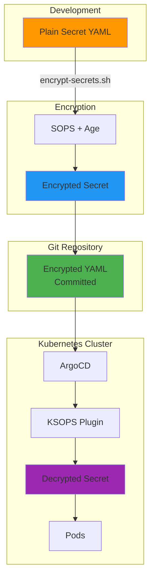
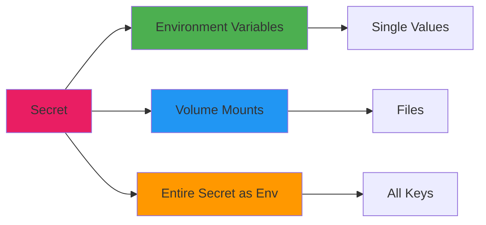

# Secrets Management

Secure management of sensitive configuration data across environments.



## Overview

Secrets contain sensitive information such as:

- Passwords and API keys
- TLS certificates (managed by cert-manager)
- Database credentials
- OAuth tokens
- Service account keys

## Secret Management Strategy

!!! warning "Security Notice"
    Base64 encoding is NOT encryption. Never commit unencrypted secrets to public repositories.

### Encryption at Rest

- Kubernetes Secrets with base64 encoding
- Etcd encryption for cluster storage
- External secrets integration possible (Vault, etc.)

### Environment Separation

- Separate secrets for staging and production
- Different credentials per environment
- No credential reuse across environments

### Access Control

- RBAC limits secret access
- ServiceAccounts with minimal permissions
- Audit logging enabled

### Rotation Policies

- Regular credential rotation
- Automated rotation where supported
- Document manual rotation procedures

## Creating Secrets

### Using kubectl

Create secrets using kubectl's `create secret` command with options:

- `generic` for arbitrary key-value pairs from literals or files
- `tls` for TLS certificates with cert and key files
- Specify namespace with `-n` flag

### Using YAML Manifests

Define secrets in YAML using `kind: Secret` with `stringData` for plain text values (Kubernetes will encode them)
or `data` for pre-encoded base64 values.

### Using the Encryption Script

This project uses SOPS with Age encryption for secure secret storage in Git.

??? example "Secret Encryption Workflow"
    1. Create a plain YAML secret file in a `secret/` directory
    2. Mark it for encryption by adding a comment (handled by script)
    3. Run the encryption script:

    ```bash
    export SOPS_AGE_KEY_FILE=~/.config/sops/age/keys.txt
    ./scripts/encrypt-secrets.sh
    ```

    The script automatically:
    - Finds YAML files marked for encryption
    - Encrypts them using SOPS and Age
    - Encrypts only `data` and `stringData` fields
    - Updates files in place

??? example "View KSOPS Generator Configuration"
    ```yaml
    # base/utils/nextcloud/secret/secret-generator.yaml
    --8<-- "base/utils/nextcloud/secret/secret-generator.yaml"
    ```

    ```yaml
    # base/utils/nextcloud/secret/kustomization.yaml
    --8<-- "base/utils/nextcloud/secret/kustomization.yaml"
    ```

!!! info "KSOPS Integration"
    ArgoCD is configured with the KSOPS plugin to automatically decrypt SOPS-encrypted
    secrets during deployment. The Age private key must be available in the ArgoCD
    repo-server for decryption to work.

## Secret Types

### Opaque Secrets

Generic secret type for arbitrary data. Values in the `data` field must be base64 encoded.

### TLS Secrets

For TLS certificates (usually managed by cert-manager automatically). Type is `kubernetes.io/tls` with `tls.crt`
and `tls.key` data fields containing base64-encoded certificate and private key.

### Docker Registry Secrets

For private container registries. Type is `kubernetes.io/dockerconfigjson` with `.dockerconfigjson` field
containing base64-encoded Docker config.

### Service Account Tokens

For Kubernetes service accounts. Type is `kubernetes.io/service-account-token` with an annotation
specifying the service account name.

## Using Secrets

Secrets can be consumed in three ways:



### Environment Variables

Inject individual secret values as environment variables using `secretKeyRef` to reference specific keys from a secret.

```yaml
env:
  - name: DB_PASSWORD
    valueFrom:
      secretKeyRef:
        name: database-credentials
        key: password
```

### Volume Mounts

Mount secrets as files in a container at a specified path. Each secret key becomes a file, useful for
configuration files or certificates. Always use `readOnly: true` for security.

```yaml
volumeMounts:
  - name: secret-volume
    mountPath: /etc/secrets
    readOnly: true
volumes:
  - name: secret-volume
    secret:
      secretName: app-secrets
```

### Entire Secret as Env

Load all keys from a secret as environment variables at once using `envFrom` with `secretRef`.

```yaml
envFrom:
  - secretRef:
      name: app-secrets
```

## Service-Specific Secrets

### Cloudflare API Token

Required for cert-manager DNS-01 challenges to verify domain ownership. Store as an Opaque secret in the
`infra` namespace with the key `cloudflare-token`.

??? example "View Cloudflare Token Secret Structure"
    ```yaml
    apiVersion: v1
    kind: Secret
    metadata:
      name: cloudflare-token-secret
      namespace: infra
    type: Opaque
    stringData:
      cloudflare-token: your-api-token-here
    ```

    This secret is encrypted with SOPS in the repository:
    `base/infra/cert-manager/issuers/secret-cloudflare-token.yaml`

### Database Credentials

PostgreSQL connection details stored as Opaque secrets in the appropriate namespace, typically containing
`username`, `password`, and `database` keys.

??? example "View Nextcloud Database Secret Structure"
    The Nextcloud secret includes both application and database credentials:

    - `NEXTCLOUD_ADMIN_USER` - Admin username
    - `NEXTCLOUD_ADMIN_PASSWORD` - Admin password
    - `DB_USERNAME` - PostgreSQL username
    - `DB_PASSWORD` - PostgreSQL password

    Location: `base/utils/nextcloud/secret/secrets.yaml` (SOPS encrypted)

### Application Secrets

Application-specific secrets contain credentials needed for initial setup or administrative access.

??? example "Media Services Secrets"
    Scraparr requires API keys for all Arr services:

    - `SONARR_API_KEY`
    - `RADARR_API_KEY`
    - `PROWLARR_API_KEY`
    - `JELLYFIN_API_KEY`

    Location: `base/htpc/scraparr/secrets.yaml` (SOPS encrypted)

## Secret Best Practices

### Security

- **Never commit plaintext secrets** to version control
- **Use strong passwords**: Generate complex credentials
- **Rotate regularly**: Change secrets periodically
- **Limit access**: Use RBAC to restrict access
- **Audit**: Monitor secret access logs

### Organization

- **Descriptive names**: Clear secret naming
- **Namespace isolation**: Secrets per namespace
- **Documentation**: Document secret purposes
- **Template files**: Provide example secrets

### Automation

- **Automated rotation**: Use automated tools where possible
- **Secret sync**: External secrets operators
- **Validation**: Check secret format before use

## External Secret Management

### HashiCorp Vault

For production environments, integrate with HashiCorp Vault using annotations for agent injection
to dynamically retrieve secrets.

### External Secrets Operator

Sync secrets from external sources using ExternalSecret CRDs that reference a SecretStore backend
and specify refresh intervals and data mappings.

### Sealed Secrets

Encrypt secrets for safe Git storage using kubeseal to create SealedSecret resources that can only be decrypted
by the cluster controller.

## Troubleshooting

### Secret Not Found

```bash
# List secrets in namespace
kubectl get secrets -n <namespace>

# Describe secret
kubectl describe secret <secret-name> -n <namespace>

# Check RBAC permissions
kubectl auth can-i get secrets -n <namespace>
```

### Incorrect Values

```bash
# View secret data (base64 encoded)
kubectl get secret <secret-name> -n <namespace> -o yaml

# Decode specific key
kubectl get secret <secret-name> -n <namespace> \
  -o jsonpath='{.data.password}' | base64 -d
```

### Pod Can't Access Secret

```bash
# Check pod events
kubectl describe pod <pod-name> -n <namespace>

# Verify secret exists
kubectl get secret <secret-name> -n <namespace>

# Check volume mounts
kubectl describe pod <pod-name> -n <namespace> | grep -A5 Mounts
```

## Secret Rotation

### Manual Rotation

1. Update secret value
2. Apply new secret
3. Restart pods to pick up new value

```bash
# Update secret
kubectl create secret generic app-secret \
  --from-literal=password=newpassword \
  --dry-run=client -o yaml | kubectl apply -f -

# Restart deployment
kubectl rollout restart deployment/<deployment-name> -n <namespace>
```

### Automated Rotation

For services with automated rotation support:

- Configure rotation schedule
- Set up monitoring
- Test rotation process
- Document recovery procedure

## Checklist

Regular secret management checklist:

- [ ] All secrets are encrypted
- [ ] No secrets in Git (plaintext)
- [ ] RBAC configured correctly
- [ ] Rotation schedule defined
- [ ] Backup secrets securely
- [ ] Document secret purposes
- [ ] Test secret access
- [ ] Monitor secret usage
- [ ] Audit secret access logs

## Related Documentation

- [Architecture: Security](../architecture/security.md)
- [Base Configurations](base-configurations.md)
- [Getting Started: Scripts](../getting-started/scripts-reference.md)
