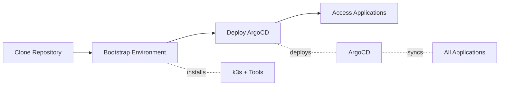

# Installation

This guide walks you through the step-by-step process of deploying the homelab platform.

## Overview

The installation process consists of three main steps:



1. Clone the repository
2. Bootstrap the environment
3. Deploy with ArgoCD

The entire process typically takes 15-30 minutes, depending on your internet speed and cluster resources.

## Step 1: Clone the Repository

Clone the homelab repository to your local machine or deployment server:

```bash
# Clone the repository
git clone https://github.com/chaitanya2692/my-homelab.git

# Navigate to the directory
cd my-homelab
```

!!! tip "Branch Selection"
    The `main` branch contains the stable configuration. For development or testing, you may want to use a different branch.

## Step 2: Bootstrap the Environment

The bootstrap script installs essential tools and prepares your environment:

```mermaid
flowchart TD
    A[Run bootstrap.sh] --> B[Update System Packages]
    B --> C[Install Homebrew]
    C --> D[Install CLI Tools]
    D --> E[Install k3s]
    E --> F[Configure kubeconfig]
    F --> G[Create Storage Directories]
    G --> H[Setup Complete]

    D -.installs.- I[kubectl, helm, kustomize<br/>k9s, kubeconform]
    E -.flags.- J[--disable servicelb<br/>--disable traefik<br/>--disable local-storage]
    F -.copies.- K[k3s.yaml to<br/>~/.kube/config]
    G -.creates.- L[/opt/cluster/htpc<br/>/opt/cluster/utils<br/>/opt/cluster/infra]
```

```bash
# Run the bootstrap script
./scripts/bootstrap.sh
```

### What Bootstrap Does

The bootstrap script performs comprehensive system setup:

- ✅ Updates system packages
- ✅ Installs Homebrew (for package management)
- ✅ Installs required CLI tools (kubectl, helm, kustomize, k9s, kubeconform)
- ✅ Installs Docker
- ✅ Installs secret management tools (SOPS, ksops, age)
- ✅ Installs K3s with custom flags (disables servicelb, traefik, local-storage)
- ✅ Configures kubeconfig
- ✅ Creates cluster storage directories at `/opt/cluster`
- ✅ Installs development tools (yq, jq, pre-commit)

!!! info "Bootstrap Script"
    The bootstrap script is idempotent for most operations - it checks if tools are already installed before attempting installation.

!!! important "Age Key Required"
    Ensure you have an Age encryption key at `~/key.txt` before running bootstrap. The script will move it to `~/.sops/key.txt`.

## Step 3: Deploy ArgoCD

ArgoCD is the GitOps tool that manages all deployments:

```mermaid
flowchart TD
    A[Run kickstart.sh] --> B[Build ArgoCD CRDs]
    B --> C[Apply CRDs]
    C --> D[Wait for CRD Established]
    D --> E[Create argocd Namespace]
    E --> F[Create SOPS Secret]
    F --> G[Build ArgoCD App]
    G --> H[Apply ArgoCD]
    H --> I[Wait for Pods Running]
    I --> J[Display Admin Password]

    B -.uses.- K[kustomize build argocd/crds<br/>--enable-helm --enable-alpha-plugins]
    F -.from.- L[/home/chaitanya/.sops/key.txt]
    G -.uses.- M[kustomize build argocd/app<br/>--enable-helm --enable-alpha-plugins]
    J -.retrieves.- N[argocd-initial-admin-secret]
```

```bash
# Kickstart ArgoCD installation
./scripts/kickstart.sh
```

### What Kickstart Does

The kickstart script:

1. **Builds and applies ArgoCD CRDs** using Kustomize from `argocd/crds`
2. **Waits for CRDs** to be established in the cluster
3. **Creates argocd namespace** (if it doesn't exist)
4. **Creates SOPS secret** from your Age key for decrypting secrets
5. **Deploys ArgoCD** application and all components
6. **Waits for all pods** to be running
7. **Displays the admin password** for ArgoCD access

!!! warning "Initial Deployment Time"
    The first deployment can take 10-20 minutes as all images are pulled and services start up.

!!! info "SOPS Key Location"
    The kickstart script expects the SOPS Age key at `/home/chaitanya/.sops/key.txt`. Adjust the path in the
    script if yours is located elsewhere.

## Step 4: Access ArgoCD

Once the kickstart script completes, you can access ArgoCD:

### Get Admin Password

```bash
# Retrieve the ArgoCD admin password
kubectl get secrets/argocd-initial-admin-secret -n argocd --template={{.data.password}} | base64 -d
```

### Access the UI

1. **Port Forward** (for local access):

    ```bash
    kubectl port-forward svc/argocd-server -n argocd 8080:443
    ```

    Then open: `https://localhost:8080`

2. **Load Balancer** (if configured):

    Navigate to: `https://argocd.yourdomain.com`

### Login

- **Username**: `admin`
- **Password**: Retrieved from the secret above

!!! tip "Change Default Password"
    For security, change the admin password after first login using the ArgoCD UI or CLI.

## Step 5: Verify Deployment

Check that all applications are deployed and healthy:

### Using kubectl

```bash
# Check all namespaces
kubectl get namespaces

# Check pods in each namespace
kubectl get pods -n infra
kubectl get pods -n utils
kubectl get pods -n htpc

# Check ArgoCD applications
kubectl get applications -n argocd
```

### Using ArgoCD UI

In the ArgoCD interface:

1. Verify all applications show "Synced" and "Healthy"
2. Check for any synchronization errors
3. Review application details for any warnings

## Post-Installation Configuration

### Configure Secrets

After deployment, configure service-specific secrets using SOPS for encryption. The `encrypt-secrets.sh` script
will encrypt any YAML files containing the `SOPS_SECRET_MARKER`.

See [Secrets Management](../configuration/secrets.md) for detailed instructions.

### Configure Ingress

Update ingress configurations with your domain:

1. Edit base ingress routes in `base/*/ingress-route.yaml`
2. Update overlay configurations for your environment
3. Commit and push changes (ArgoCD will auto-sync)

### Configure Storage

Verify storage provisioning:

```bash
# Check persistent volumes
kubectl get pv

# Check persistent volume claims
kubectl get pvc -A
```

## Troubleshooting

### Common Issues

??? question "ArgoCD pods not starting"

    **Symptom**: ArgoCD pods remain in Pending or CrashLoopBackOff state.

    **Solution**:

    ```bash
    # Check pod status and events
    kubectl get pods -n argocd
    kubectl describe pod -n argocd <pod-name>

    # Verify SOPS secret exists
    kubectl get secret sops-age -n argocd

    # Check ArgoCD server logs
    kubectl logs -n argocd -l app.kubernetes.io/name=argocd-server

    # Check resource availability
    kubectl top nodes
    kubectl top pods -n argocd
    ```

??? question "Services not accessible"

    **Symptom**: Cannot access services through ingress.

    **Solution**:

    ```bash
    # Check Traefik status
    kubectl get pods -n infra -l app.kubernetes.io/name=traefik

    # Check ingress routes
    kubectl get ingressroute -A

    # Check LoadBalancer IP
    kubectl get svc -n infra traefik

    # Verify MetalLB is running
    kubectl get pods -n infra -l app.kubernetes.io/name=metallb
    ```

??? question "Certificate issues"

    **Symptom**: TLS certificates not being issued.

    **Solution**:

    ```bash
    # Check cert-manager pods
    kubectl get pods -n infra -l app.kubernetes.io/name=cert-manager

    # Check certificate requests
    kubectl get certificaterequest -A
    kubectl get certificate -A

    # Check cert-manager logs
    kubectl logs -n infra -l app.kubernetes.io/name=cert-manager

    # Verify ClusterIssuer
    kubectl get clusterissuer
    ```

??? question "Storage provisioning fails"

    **Symptom**: PVCs remain in Pending state.

    **Solution**:

    ```bash
    # Check local-path-provisioner
    kubectl get pods -n infra -l app.kubernetes.io/name=local-path-provisioner

    # Verify storage directories exist
    ls -la /opt/cluster/

    # Check PVC events
    kubectl describe pvc -n <namespace> <pvc-name>

    # List storage classes
    kubectl get storageclass
    ```

### Getting Help

If you encounter issues:

1. Check the [ArgoCD documentation](https://argo-cd.readthedocs.io/)
2. Review application logs: `kubectl logs -n <namespace> <pod-name>`
3. Open an issue on the [GitHub repository](https://github.com/chaitanya2692/my-homelab/issues)

## Next Steps

Now that your platform is deployed:

- 📖 Review the [Architecture](../architecture/index.md) documentation
- 🔧 Explore [Configuration](../configuration/index.md) options
- 🚀 Browse available [Services](../services/index.md)
- 📜 Learn about automation [Scripts](scripts-reference.md)
