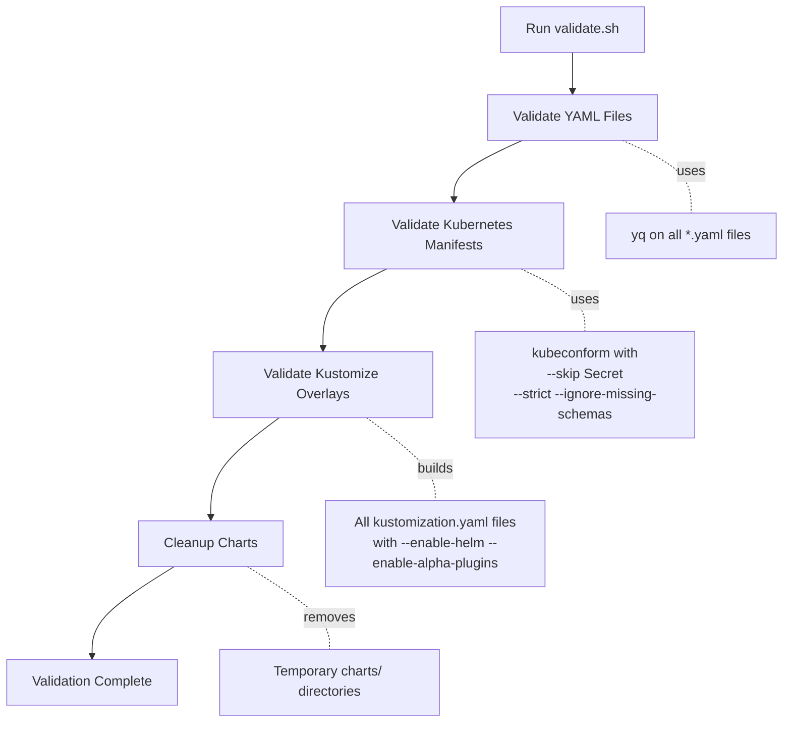
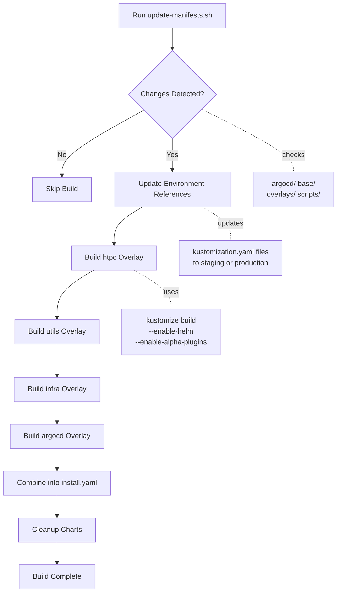

# Scripts Reference

The homelab platform includes several automation scripts to simplify common operations.
All scripts are located in the `scripts/` directory.

## Script Overview

| Script | Purpose | When to Use |
| ------ | ------- | ----------- |
| 🛠️ bootstrap.sh | Install essential libraries in a new Ubuntu VM | Initial setup on a fresh system |
| ✅ validate.sh | Config Check | Before applying changes |
| 🚀 deploy.sh | Deployment | Manual deployment without ArgoCD |
| 💣 nuke.sh | Reset Cluster | Complete cleanup and reset |
| ⚡ kickstart.sh | Install ArgoCD and deploy services | Initial platform deployment |
| 🛠️ update-manifests.sh | Kustomize build Script | Generate deployment manifests |
| 🔐 encrypt-secrets.sh | Encode secrets in the repo | Managing sensitive configuration |

## Detailed Script Documentation

### bootstrap.sh

**Purpose**: Prepares a fresh Ubuntu system with all required dependencies.

```mermaid
flowchart TD
    A[Run bootstrap.sh] --> B[Update System Packages]
    B --> C[Install Essential Tools]
    C --> D[Install Homebrew]
    D --> E[Install CLI Tools]
    E --> F[Install Docker]
    F --> G[Install Secret Management Tools]
    G --> H[Install k3s]
    H --> I[Configure kubeconfig]
    I --> J[Create Storage Directories]
    J --> K[Setup Complete]

    C -.installs.- L[curl, wget, git, jq, build-essential]
    E -.installs.- M[kubeconform, k9s, helm<br/>kustomize, yq, pre-commit]
    G -.installs.- N[sops, ksops, age<br/>moves ~/key.txt to ~/.sops/]
    H -.flags.- O[--disable servicelb<br/>--disable traefik<br/>--disable local-storage]
    I -.copies.- P[/etc/rancher/k3s/k3s.yaml<br/>to ~/.kube/config]
    J -.creates.- Q[/opt/cluster/htpc<br/>/opt/cluster/utils<br/>/opt/cluster/infra]
```

**Usage**:

```bash
./scripts/bootstrap.sh
```

**What it does**:

- Updates system packages (`apt update && apt upgrade`)
- Installs essential tools: `curl`, `wget`, `git`, `unzip`, `jq`, `build-essential`
- Installs Homebrew (if not present)
- Installs via Homebrew: `kubeconform`, `k9s`, `kustomize`
- Installs Docker
- Installs Helm from official script
- Installs SOPS (latest version from GitHub)
- Installs ksops (kustomize SOPS plugin)
- Installs Age encryption tool and sets up key in `~/.sops/key.txt`
- Installs yq (YAML processor)
- Installs pip and pre-commit
- Installs K3s with flags: `--disable servicelb --disable traefik --disable local-storage`
- Configures kubeconfig in `~/.kube/config`
- Creates cluster storage directories: `/opt/cluster/{htpc,utils,infra}`

**Prerequisites**:

- Ubuntu 20.04+ or Debian 10+
- Sudo access
- Internet connectivity
- Age key file at `~/key.txt` (will be moved to `~/.sops/key.txt`)

**Output**:

```text
Bootstrap complete! Please log out and log back in to ensure all changes take effect.
```

!!! warning "First-time Setup Only"
    This script modifies system packages and configurations. Run it only on initial setup or when setting up a new node.

!!! important "Age Key Required"
    The script expects an Age encryption key file at `~/key.txt`. If not found, the script will exit with an error.

---

### validate.sh

**Purpose**: Validates Kubernetes manifests and configuration files before deployment.



**Usage**:

```bash
./scripts/validate.sh
```

**What it does**:

- Validates all YAML files in the repository using `yq`
- Validates Kubernetes manifests using `kubeconform` (skips Secrets)
- Validates all kustomization overlays by building and checking output
- Cleans up temporary chart directories after validation

**Validation Flags**:

- `--load-restrictor=LoadRestrictionsNone`: Allows Kustomize to load files from outside the base
- `--enable-helm`: Enables Helm chart inflation
- `--enable-alpha-plugins`: Enables alpha plugins
- `--enable-exec`: Enables exec plugins (for ksops)
- `-skip=Secret`: Skips Secret validation (encrypted secrets can't be validated)
- `-strict`: Strict validation mode
- `-ignore-missing-schemas`: Ignores missing schemas
- `-verbose`: Verbose output

**When to use**:

- Before committing changes
- Before deploying to production
- As part of CI/CD pipeline
- After modifying YAML files

**Output**:

```text
INFO - Validating YAML files
INFO - Validating ./base/htpc/kustomization.yaml
INFO - Validating Kubernetes manifests
INFO - Validating kustomize overlays
INFO - Validating kustomization ./overlays/htpc/
...
```

!!! tip "CI/CD Integration"
    This script is ideal for pre-commit hooks and CI/CD pipelines to catch errors before deployment.

---

### deploy.sh

**Purpose**: Deploy pre-generated manifests from `install.yaml`, separating CRDs from other resources.

**Usage**:

```bash
./scripts/deploy.sh
```

**What it does**:

- Separates CRDs from non-CRD resources in `install.yaml`
- Applies CRDs first and waits for them to be established
- Applies remaining resources
- Cleans up temporary files

**When to use**:

- Deploying from pre-built manifests
- Testing generated configurations
- Manual deployment scenarios
- When not using ArgoCD

**Prerequisites**:

- `install.yaml` must exist (generated by `update-manifests.sh`)
- kubectl must be configured with cluster access

!!! warning "Production Use"
    For production, use ArgoCD instead of manual deployment to maintain GitOps principles.

---

### nuke.sh

**Purpose**: Complete K3s uninstall and reinstall.

**Usage**:

```bash
./scripts/nuke.sh
```

**What it does**:

- Uninstalls existing K3s installation completely using k3s-uninstall script
- Reinstalls K3s with custom flags: `--disable servicelb --disable traefik` (note: does NOT disable local-storage)
- Copies kubeconfig from `/etc/rancher/k3s/k3s.yaml` to `~/.kube/config`

**When to use**:

- Complete cluster reset needed
- Starting fresh from scratch
- Troubleshooting persistent K3s issues
- Cleaning up failed installations

!!! danger "Destructive Operation"
    This script completely removes K3s and all cluster data. All deployments, configurations, and persistent volumes
    will be lost. Ensure you have backups before running.

!!! warning "Flag Difference"
    Unlike bootstrap.sh which disables servicelb, traefik, AND local-storage, nuke.sh only disables servicelb
    and traefik. Update the script if you need consistent behavior.

---

### kickstart.sh

**Purpose**: Initial ArgoCD installation and application deployment.

**Usage**:

```bash
./scripts/kickstart.sh
```

**What it does**:

1. **Builds and applies ArgoCD CRDs** using Kustomize
2. **Waits for CRDs** to be established (specifically `applications.argoproj.io`)
3. **Creates ArgoCD namespace** (if not exists)
4. **Creates SOPS-Age secret** from `/home/chaitanya/.sops/key.txt` for encrypted secrets
5. **Builds and applies ArgoCD application** resources
6. **Waits for all pods** in the argocd namespace to be running
7. **Displays admin password** for accessing ArgoCD UI

**Prerequisites**:

- kubectl configured and connected to cluster
- SOPS Age key at `/home/chaitanya/.sops/key.txt` (hardcoded path in script)
- Kustomize, kubectl, and required tools installed

**When to use**:

- Initial platform setup
- After running nuke.sh
- Setting up a new cluster

**Output**:

The script displays the ArgoCD initial admin password:

```text
ArgoCD secret password:
<password-here>
```

To access the ArgoCD UI before the ingress route is active, port-forward the service:

```bash
kubectl port-forward svc/argocd-server -n argocd --address 0.0.0.0 8080:443
```

!!! info "One-time Setup"
    After successful kickstart, ArgoCD manages all deployments automatically.

---

### update-manifests.sh

**Purpose**: Build Kustomize manifests and generate combined install.yaml.



**Usage**:

```bash
./scripts/update-manifests.sh [environment]
```

**Parameters**:

- `environment` (optional): Target environment (`staging` or `production`). Defaults to `staging`.

**What it does**:

- Checks for changes in `argocd`, `base`, `overlays`, or `scripts` directories
- Updates environment references in kustomization files
- Runs `kustomize build` for each overlay (htpc, utils, infra, argocd)
- Generates a combined `install.yaml` file in the repository root
- Cleans up temporary chart directories

**When to use**:

- After modifying base configurations or overlays
- Before manual deployment with `deploy.sh`
- Testing Kustomize builds
- Generating deployment artifacts

**Output Location**:

Generated file: `install.yaml` (in repository root)

!!! info "Smart Updates"
    The script only rebuilds if changes are detected in relevant directories, saving time on unchanged configurations.

---

### encrypt-secrets.sh

**Purpose**: Encrypt Kubernetes secrets using SOPS and Age encryption.

```mermaid
flowchart TD
    A[Run encrypt-secrets.sh] --> B{SOPS_AGE_KEY_FILE Set?}
    B -->|No| C[Error: Exit]
    B -->|Yes| D{Key File Exists?}
    D -->|No| C
    D -->|Yes| E[Find All YAML Files]
    E --> F{Contains SOPS_SECRET_MARKER?}
    F -->|No| G[Skip File]
    F -->|Yes| H[Encrypt data/stringData Fields]
    H --> I[Remove Marker]
    I --> J[Add YAML Separator]
    J --> K[Update File In-Place]
    K --> L[Continue to Next File]

    H -.uses.- M[sops --encrypt --age<br/>--encrypted-regex '^data|stringData'$']
    L --> F
```

**Usage**:

```bash
# Set the SOPS age key file location
export SOPS_AGE_KEY_FILE=$HOME/.sops/key.txt

# Run the encryption script
./scripts/encrypt-secrets.sh
```

**Prerequisites**:

- `SOPS_AGE_KEY_FILE` environment variable must be set
- Age key file must exist at the specified location
- Secret YAML files must contain the `SOPS_SECRET_MARKER` comment

**What it does**:

- Searches for all YAML files in the repository
- Identifies files containing `SOPS_SECRET_MARKER`
- Encrypts the `data` and `stringData` fields using SOPS with Age
- Removes the marker and adds YAML document separator
- Updates files in place

**When to use**:

- After adding new secrets to YAML files
- Before committing secrets to version control
- When rotating encryption keys
- Setting up secrets for new environments

**Secret Format**:

Mark files for encryption by adding a comment:

```yaml
# SOPS_SECRET_MARKER
apiVersion: v1
kind: Secret
metadata:
  name: my-secret
stringData:
  password: mysecretpassword
```

!!! success "Secure Secret Management"
    SOPS encryption allows secrets to be safely committed to version control while keeping values encrypted at rest.

---

## Script Best Practices

### Running Scripts Safely

1. **Always validate first**: Run `validate.sh` before deployment scripts
2. **Use dry-run**: Test with `--dry-run` flag when available
3. **Check cluster context**: Verify you're targeting the correct cluster
4. **Review output**: Read script output carefully for errors or warnings

### Automation

These scripts can be integrated into CI/CD pipelines. For example, in GitHub Actions, you can run validation,
update manifests, and perform dry-run deployments as part of your workflow steps.

### Troubleshooting Scripts

If a script fails:

1. **Check prerequisites**: Ensure required tools are installed
2. **Verify permissions**: Ensure you have cluster access
3. **Review logs**: Check script output for error messages
4. **Manual execution**: Try running commands manually for debugging

### Custom Scripts

To add custom scripts:

1. Place them in the `scripts/` directory
2. Make them executable: `chmod +x scripts/myscript.sh`
3. Follow existing script patterns
4. Add documentation to this page

## Additional Resources

- [ArgoCD CLI Documentation](https://argo-cd.readthedocs.io/en/stable/user-guide/commands/argocd/)
- [Kustomize Reference](https://kubectl.docs.kubernetes.io/references/kustomize/)
- [kubectl Cheat Sheet](https://kubernetes.io/docs/reference/kubectl/cheatsheet/)
