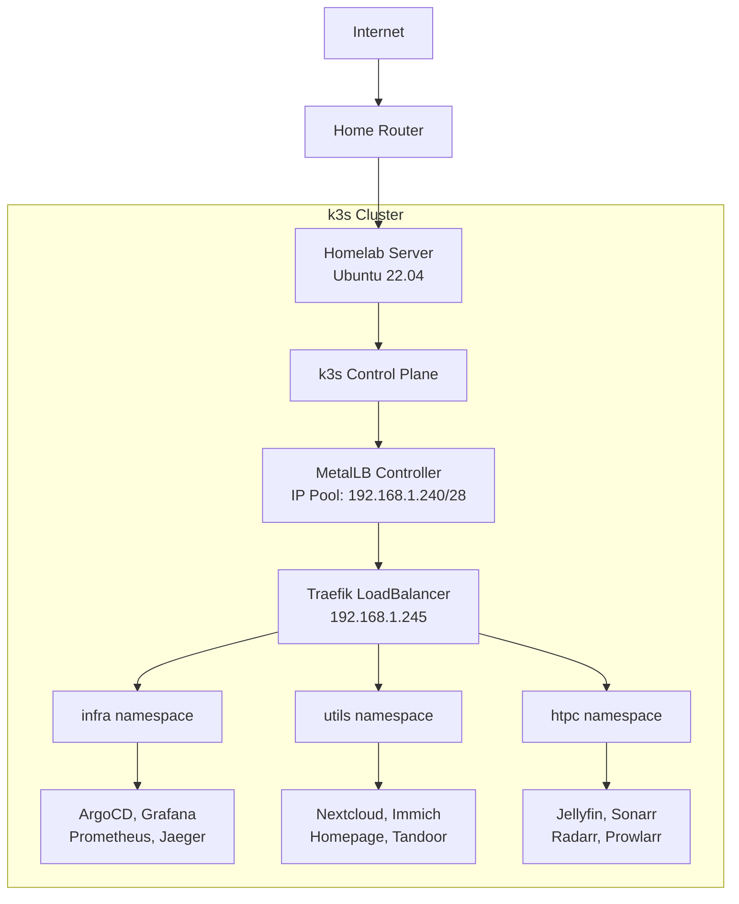
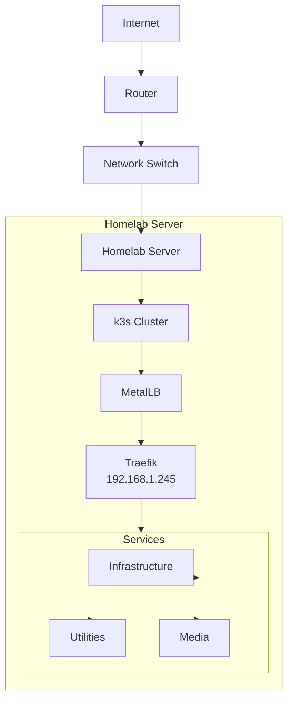

# Network Reference

IP addressing, port allocations, and load balancer configuration reference.

## Network Architecture Overview



## IP Address Allocation

### MetalLB IP Pool

**IP Range:** `192.168.1.240/28`

| Start IP | End IP | Total Addresses | Usable Addresses |
| ------------- | ------------- | --------------- | ---------------- |
| 192.168.1.240 | 192.168.1.255 | 16 | 16 |

### Reserved IP Assignments

| IP Address        | Service   | Purpose                                     |
|-------------------|-----------|---------------------------------------------|
| 192.168.1.245     | Traefik   | Primary ingress controller LoadBalancer     |
| 192.168.1.246-255 | Available | Future services                             |

### IP Range Considerations

!!! warning "Network Planning"
    Ensure the MetalLB IP range does not overlap with:

    - DHCP server allocation pool
    - Static IP assignments
    - Other network services

## Port Allocations

### External Ports (Traefik LoadBalancer)

| Port | Protocol | Service | Purpose                     |
|------|----------|---------|-----------------------------|
| 80   | TCP      | HTTP    | Automatic redirect to HTTPS |
| 443  | TCP      | HTTPS   | TLS-encrypted traffic       |

### Kubernetes API

| Port | Protocol | Service        | Purpose               |
|------|----------|----------------|-----------------------|
| 6443 | TCP      | k3s API Server | Kubernetes API access |

### Internal Service Ports

#### Infrastructure Services

| Service | Port | Protocol | Purpose |
| ------- | ---- | -------- | ------- |
| ArgoCD Server | 80, 443 | TCP | GitOps UI (HTTP/HTTPS) |
| ArgoCD Metrics | 8083 | TCP | Metrics endpoint |
| Grafana | 80 | TCP | Dashboards |
| Prometheus | 9090 | TCP | Metrics API |
| Loki | 3100 | TCP | Log ingestion |
| Jaeger Query | 16686 | TCP | Trace UI |
| Jaeger Collector | 14250, 4317 | TCP | Trace collection |

#### Personal Cloud Services

| Service | Port | Protocol | Purpose |
| ------- | ---- | -------- | ------- |
| Nextcloud | 80 | TCP | Web interface |
| Immich | 3001 | TCP | Web interface (Helm chart default) |
| Immich ML | 3003 | TCP | ML processing (Helm chart default) |
| Homepage | 3000 | TCP | Dashboard |
| Tandoor | 80, 8080 | TCP | Web interface (HTTP and Gunicorn) |

!!! info "Helm Chart Defaults"
    Immich ports are based on the official Helm chart defaults. The actual ports are managed by the chart
    and may vary with different versions.

#### Media Services

| Service | Port | Protocol | Purpose |
| ------- | ---- | -------- | ------- |
| Jellyfin | 8096 | TCP | Web interface and streaming |
| Jellyfin HTTPS | 8920 | TCP | Secure streaming |
| Sonarr | 8989 | TCP | Web interface |
| Radarr | 7878 | TCP | Web interface |
| Prowlarr | 9696 | TCP | Web interface |
| Transmission | 9091 | TCP | Web interface |
| FlareSolverr | 8191 | TCP | CAPTCHA solver API |
| Scraparr | 7100 | TCP | Metadata API |

#### Data Layer

| Service | Port | Protocol | Purpose |
| ------- | ---- | -------- | ------- |
| PostgreSQL | 5432 | TCP | Database connection |
| Redis | 6379 | TCP | Cache connection |
| Valkey | 6379 | TCP | Cache connection |

## DNS Configuration

### Domain Structure

```text
example.com                     # Root domain
├── *.example.com              # Wildcard (all services)
├── argocd.example.com         # ArgoCD UI
├── grafana.example.com        # Grafana dashboards
├── nextcloud.example.com      # Nextcloud
├── immich.example.com         # Immich
├── jellyfin.example.com       # Jellyfin
└── ...                        # Other services
```

### DNS Records

#### A Record (Root)

```text
Type: A
Name: @
Content: <external-ip>
Proxy: Enabled (Cloudflare)
```

#### CNAME Record (Wildcard)

```text
Type: CNAME
Name: *
Content: @
Proxy: Enabled (Cloudflare)
```

### Internal DNS

For local-only access:

```bash
# /etc/hosts or local DNS server
192.168.1.245 argocd.local.domain
192.168.1.245 grafana.local.domain
192.168.1.245 nextcloud.local.domain
```

## Network Topology



## Firewall Configuration

### Required Inbound Rules

| Port | Protocol | Source | Description |
| ---- | -------- | ------ | ----------- |
| 80 | TCP | Any | HTTP (redirects to HTTPS) |
| 443 | TCP | Any | HTTPS |
| 6443 | TCP | Admin IPs | Kubernetes API (restrict) |

### Optional Inbound Rules

| Port | Protocol | Source | Description |
| ---- | -------- | --------- | ---------------------------- |
| 22 | TCP | Admin IPs | SSH access (if enabled) |

### Outbound Rules

| Port | Protocol | Destination | Description |
| ---------- | -------- | ----------- | ------------------------------- |
| 80, 443 | TCP | Any | HTTP/HTTPS (updates, downloads) |
| 53 | UDP | DNS Servers | DNS queries |

## Network Policies

### Default Deny

```yaml
apiVersion: networking.k8s.io/v1
kind: NetworkPolicy
metadata:
  name: default-deny-all
  namespace: utils
spec:
  podSelector: {}
  policyTypes:
    - Ingress
    - Egress
```

### Allow from Traefik

```yaml
apiVersion: networking.k8s.io/v1
kind: NetworkPolicy
metadata:
  name: allow-from-traefik
  namespace: utils
spec:
  podSelector:
    matchLabels:
      app: my-app
  policyTypes:
    - Ingress
  ingress:
    - from:
        - namespaceSelector:
            matchLabels:
              name: infra
        - podSelector:
            matchLabels:
              app.kubernetes.io/name: traefik
      ports:
        - protocol: TCP
          port: 8080
```

### Allow DNS

```yaml
apiVersion: networking.k8s.io/v1
kind: NetworkPolicy
metadata:
  name: allow-dns
spec:
  podSelector: {}
  policyTypes:
    - Egress
  egress:
    - to:
        - namespaceSelector:
            matchLabels:
              name: kube-system
        - podSelector:
            matchLabels:
              k8s-app: kube-dns
      ports:
        - protocol: UDP
          port: 53
```

## Load Balancer Configuration

### MetalLB Layer 2 Configuration

**Actual Configuration:**

```yaml
--8<-- "base/infra/metallb/metallb.yaml"
```

The MetalLB IPAddressPool and L2Advertisement are deployed in the `infra` namespace via Kustomize.

**Example with Namespace (for reference):**

```yaml
apiVersion: metallb.io/v1beta1
kind: IPAddressPool
metadata:
  name: first-pool
  namespace: infra
spec:
  addresses:
    - 192.168.1.240/28

---
apiVersion: metallb.io/v1beta1
kind: L2Advertisement
metadata:
  name: empty
  namespace: infra
```

### Service LoadBalancer Example

Traefik is deployed as a LoadBalancer service. The actual configuration is managed via Helm values:

```yaml
--8<-- "base/infra/traefik/values.yaml:81:88"
```

This creates a LoadBalancer service that MetalLB assigns to `192.168.1.245`. The Helm chart handles port mappings automatically:

- Port 80 (web) → redirects to HTTPS
- Port 443 (websecure) → TLS-encrypted traffic
- Port 8082 (metrics) → Prometheus metrics

## Ingress Configuration

### IngressRoute Example

```yaml
apiVersion: traefik.containo.us/v1alpha1
kind: IngressRoute
metadata:
  name: service-ingress
  namespace: utils
spec:
  entryPoints:
    - websecure
  routes:
    - match: Host(`service.example.com`)
      kind: Rule
      services:
        - name: service
          port: 80
      middlewares:
        - name: security-headers
  tls:
    secretName: wildcard-cert
```

### Middleware Example

```yaml
apiVersion: traefik.containo.us/v1alpha1
kind: Middleware
metadata:
  name: security-headers
  namespace: infra
spec:
  headers:
    sslRedirect: true
    stsSeconds: 31536000
    stsIncludeSubdomains: true
    stsPreload: true
    forceSTSHeader: true
    contentTypeNosniff: true
    browserXssFilter: true
    referrerPolicy: "same-origin"
```

## Troubleshooting

### Network Troubleshooting

```bash
# Test external access
curl -I https://service.example.com

# Test internal service
kubectl run -it --rm debug --image=curlimages/curl --restart=Never -- \
  curl http://service.namespace.svc.cluster.local

# Test DNS resolution
kubectl run -it --rm debug --image=busybox --restart=Never -- \
  nslookup service.namespace.svc.cluster.local

# Check network policies
kubectl get networkpolicy -A
kubectl describe networkpolicy <name> -n <namespace>
```

### MetalLB Debugging

```bash
# Check speaker pods
kubectl get pods -n infra -l app=metallb,component=speaker

# Check controller logs
kubectl logs -n infra -l app=metallb,component=controller

# Check IP assignments
kubectl get svc -A | grep LoadBalancer |

# Describe service
kubectl describe svc traefik -n infra
```

### Traefik Debugging

```bash
# Check Traefik pods
kubectl get pods -n infra -l app.kubernetes.io/name=traefik

# View Traefik logs
kubectl logs -n infra -l app.kubernetes.io/name=traefik

# Check IngressRoutes
kubectl get ingressroute -A

# Describe IngressRoute
kubectl describe ingressroute <name> -n <namespace>

# Access Traefik dashboard
kubectl port-forward -n infra svc/traefik 9000:9000
# Visit http://localhost:9000/dashboard/
```

## Related Documentation

- [Architecture: Networking](../architecture/networking.md)
- [Architecture: Security](../architecture/security.md)
- [Services: Core Platform](../services/core-platform.md)
