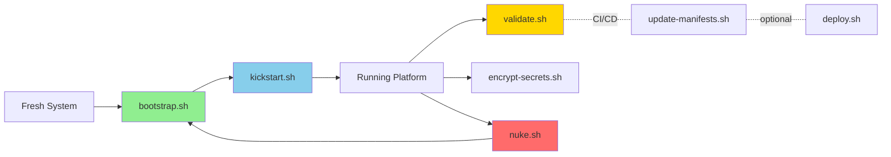

# Scripts API

Detailed documentation for automation scripts with parameters, options, and usage examples.

## Script Overview



## Script Location

All scripts are located in the `scripts/` directory at the repository root.

## bootstrap.sh

Install essential tools and prepare a fresh Ubuntu system.

### bootstrap.sh Synopsis

```bash
./scripts/bootstrap.sh
```

### bootstrap.sh Description

Prepares a fresh Ubuntu system with all required dependencies for running the homelab platform.

### bootstrap.sh What It Does

1. Updates system packages
2. Installs essential tools (curl, wget, git, jq, build-essential)
3. Installs Homebrew (if not present)
4. Installs kubeconform via Homebrew
5. Installs k9s via Homebrew
6. Installs Docker (if not present)
7. Installs Helm
8. Installs kustomize via Homebrew
9. Installs SOPS (latest version from GitHub)
10. Installs ksops (kustomize SOPS plugin)
11. Installs age encryption tool
12. Moves Age key from `~/key.txt` to `~/.sops/key.txt`
13. Installs yq (YAML processor)
14. Installs pip and pre-commit
15. Sets up pre-commit hooks with `pre-commit install`
16. Installs K3s with flags: `--disable servicelb --disable traefik --disable local-storage`
17. Configures kubeconfig at `~/.kube/config`
18. Creates cluster storage directories at `/opt/cluster/{htpc,utils,infra}`
19. Sets proper permissions on storage directories

### bootstrap.sh Prerequisites

- Ubuntu 20.04+ or Debian 10+
- Sudo access
- Internet connectivity
- **Age key file at `~/key.txt`** (will be moved to `~/.sops/key.txt`)

!!! warning "Age Key Required"
    The script will exit with an error if `~/key.txt` is not found. Generate it first with `age-keygen -o ~/key.txt`.

### bootstrap.sh Exit Codes

| Code | Meaning |
| ------ | --------- |
| 0 | Success |
| 1 | General error |

### bootstrap.sh Example

```bash
# Run the bootstrap script
./scripts/bootstrap.sh
```

---

## validate.sh

Validate Kubernetes manifests and configuration files.

### validate.sh Synopsis

```bash
./scripts/validate.sh
```

### validate.sh Description

Runs comprehensive validation on YAML files and Kubernetes manifests in the repository.

### validate.sh What It Does

1. YAML syntax validation using yq
2. Kubernetes schema validation using kubeconform
3. Validates all kustomization overlays
4. Cleans up temporary chart directories

### validate.sh Exit Codes

| Code | Meaning |
| ------ | --------- |
| 0 | All validations passed |
| 1 | Validation errors found |

### validate.sh Example

```bash
# Run validation from repository root
./scripts/validate.sh
```

---

## deploy.sh

Deploy manifests by separating CRDs from other resources.

### Synopsis

```bash
./scripts/deploy.sh
```

### Description

Deploys Kubernetes manifests by properly handling CRDs and non-CRD resources separately.

### What It Does

1. Separates CRDs from non-CRD resources in install.yaml
2. Applies CRDs first
3. Waits for CRDs to be established
4. Applies non-CRD resources
5. Cleans up temporary files

### Exit Codes

| Code | Meaning |
| ------ | --------- |
| 0 | Deployment successful |
| 1 | Deployment failed |

### Example

```bash
# Deploy all resources
./scripts/deploy.sh
```

---

## nuke.sh

Complete k3s cluster reset and reinstallation.

### nuke.sh Synopsis

```bash
./scripts/nuke.sh
```

### nuke.sh Description

Performs complete uninstallation and reinstallation of k3s without default components.

!!! danger "Destructive Operation"
    This operation uninstalls k3s completely and reinstalls it fresh.

### nuke.sh What It Does

1. Uninstalls existing k3s installation using `/usr/local/bin/k3s-uninstall.sh`
2. Reinstalls k3s with flags: `--disable servicelb --disable traefik` (note: does NOT disable local-storage)
3. Copies kubeconfig from `/etc/rancher/k3s/k3s.yaml` to `~/.kube/config`

!!! warning "Inconsistent Flags"
    Unlike `bootstrap.sh` which disables servicelb, traefik, AND local-storage, `nuke.sh` only disables servicelb and traefik.

### nuke.sh Exit Codes

| Code | Meaning |
| ------ | --------- |
| 0 | Reset successful |
| 1 | Reset failed |

### nuke.sh Example

```bash
# Reset and reinstall k3s
./scripts/nuke.sh
```

---

## kickstart.sh

Install ArgoCD and bootstrap the platform.

### kickstart.sh Synopsis

```bash
./scripts/kickstart.sh
```

### kickstart.sh Description

Performs initial ArgoCD installation and displays access credentials.

### kickstart.sh What It Does

1. Builds and applies ArgoCD CRDs
2. Waits for Application CRD to be established
3. Creates argocd namespace
4. Creates sops-age secret from `/home/chaitanya/.sops/key.txt`
5. Deploys ArgoCD application resources
6. Waits for all pods to be running
7. Displays ArgoCD admin password

### Output

The script displays installation progress and provides the ArgoCD initial admin password.

### kickstart.sh Exit Codes

| Code | Meaning |
| ------ | --------- |
| 0 | Installation successful |
| 1 | Installation failed |

### kickstart.sh Example

```bash
# Install ArgoCD
./scripts/kickstart.sh

# After installation, access ArgoCD UI via port-forward:
# kubectl port-forward svc/argocd-server -n argocd --address 0.0.0.0 8080:443
```

---

## update-manifests.sh

Build Kustomize manifests and generate install files.

### update-manifests.sh Synopsis

```bash
./scripts/update-manifests.sh [ENVIRONMENT]
```

### update-manifests.sh Description

Builds Kustomize overlays and generates deployment manifests for specified environment.

### update-manifests.sh What It Does

1. Checks for changes in relevant files (argocd, base, overlays, scripts)
2. If no changes are detected, exits successfully without rebuilding
3. Updates environment in kustomization files
4. Builds each overlay (htpc, utils, infra, argocd) with kustomize
5. Generates consolidated install.yaml file
6. Cleans up temporary chart directories

### update-manifests.sh Arguments

| Argument | Description | Default |
| ---------- | ------------- | --------- |
| ENVIRONMENT | Target environment (staging/production) | staging |

### update-manifests.sh Output Location

Generated file is placed at `install.yaml` in the repository root.

### update-manifests.sh Exit Codes

| Code | Meaning |
| ------ | --------- |
| 0 | Build successful, no changes detected, or no rebuild needed |
| 1 | Build failed |

### update-manifests.sh Example

```bash
# Build for staging environment (default)
./scripts/update-manifests.sh

# Build for production environment
./scripts/update-manifests.sh production
```

---

## encrypt-secrets.sh

Encrypt Kubernetes secrets using SOPS and Age.

### encrypt-secrets.sh Synopsis

```bash
SOPS_AGE_KEY_FILE=/path/to/key.txt ./scripts/encrypt-secrets.sh
```

### encrypt-secrets.sh Description

Manages secret encryption using SOPS and Age for secure storage in Git.

### encrypt-secrets.sh What It Does

1. Checks for SOPS_AGE_KEY_FILE environment variable
2. Finds all YAML files with SOPS_SECRET_MARKER comment
3. Encrypts matching files using SOPS with Age
4. Removes the marker and adds YAML separator
5. Reports number of files encrypted

### encrypt-secrets.sh Environment Variables

| Variable | Description | Required |
| ---------- | ------------- | ---------- |
| SOPS_AGE_KEY_FILE | Path to Age key file | Yes |

### encrypt-secrets.sh Input Format

Input files should be Kubernetes Secret manifests with the `# SOPS_SECRET_MARKER` comment:

```yaml
# SOPS_SECRET_MARKER
apiVersion: v1
kind: Secret
metadata:
  name: example-secret
stringData:
  username: myuser
  password: mypassword
```

### encrypt-secrets.sh Output Format

The script encrypts the `data` and `stringData` fields in place using SOPS:

```yaml
---
apiVersion: v1
kind: Secret
metadata:
    name: example-secret
stringData:
    username: ENC[AES256_GCM,...]
    password: ENC[AES256_GCM,...]
sops:
    ...
```

### encrypt-secrets.sh Exit Codes

| Code | Meaning |
| ------ | --------- |
| 0 | Operation successful |
| 1 | Operation failed or missing key file |

### encrypt-secrets.sh Example

```bash
# Encrypt all secrets with marker
export SOPS_AGE_KEY_FILE=/home/chaitanya/.sops/key.txt
./scripts/encrypt-secrets.sh
```

---

## Common Script Patterns

### Error Handling

All scripts follow consistent error handling:

```bash
set -euo pipefail  # Exit on error, undefined variables, pipe failures
```

### Logging

Standard logging format:

```text
[INFO] Starting operation
[WARN] Warning message
[ERROR] Error occurred
[SUCCESS] Operation completed
```

### Prerequisites Check

Scripts check for required tools:

```bash
command -v kubectl >/dev/null 2>&1 |  | { |
  echo "kubectl is required"
  exit 2
}
```

## Integration with CI/CD

### GitHub Actions Example

```yaml
- name: Validate
  run: ./scripts/validate.sh

- name: Build
  run: ./scripts/update-manifests.sh

- name: Deploy
  run: ./scripts/deploy.sh
```

### Pre-commit Hook

```.git/hooks/pre-commit
#!/bin/bash
./scripts/validate.sh
```

## Troubleshooting Scripts

### Enable Debug Mode

```bash
# Run with debug output
bash -x ./scripts/script-name.sh
```

### Check Script Permissions

```bash
# Ensure scripts are executable
chmod +x scripts/*.sh
```

### View Script Source

```bash
# Read script to understand behavior
cat scripts/script-name.sh
less scripts/script-name.sh
```

## Related Documentation

- [Getting Started: Scripts Reference](../getting-started/scripts-reference.md)
- [Architecture: CI/CD](../architecture/cicd.md)
- [Configuration Management](../architecture/configuration-management.md)
