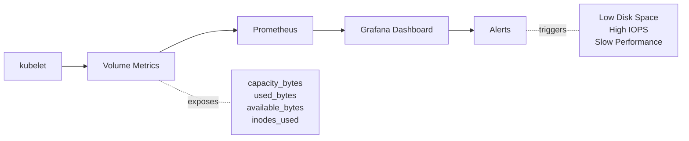

# Storage Reference

Complete specifications and details for persistent storage in the platform.

## Storage Architecture

```mermaid
flowchart TD
    A[Local Path Provisioner] --> B[StorageClass: local-path-infra]
    A --> C[StorageClass: local-path-htpc]
    A --> D[StorageClass: local-path-utils]

    B --> E[/opt/cluster/infra]
    C --> F[/opt/cluster/htpc]
    D --> G[/opt/cluster/utils]

    E --> H[Infra PVCs<br/>26GB Total]
    F --> I[HTPC PVCs<br/>500GB Total]
    G --> J[Utils PVCs<br/>87GB Total]

    H -.contains.- K[Grafana: 5GB<br/>Jaeger: 10GB<br/>Traefik: 1GB<br/>Alloy: 10GB]
    I -.contains.- L[htpc-pvc: 500GB<br/>Media + App Data]
    J -.contains.- M[Immich: 35GB<br/>Nextcloud: 32GB<br/>Tandoor: 20GB]
```

## Storage Classes

### local-path (per namespace)

Default storage class using local-path-provisioner with namespace-specific configurations.

#### Specifications

| Property | Value |
| ---------- | ------- |
| Provisioner | rancher.io/local-path |
| Volume Binding Mode | WaitForFirstConsumer |
| Reclaim Policy | Retain |
| Volume Expansion | No (by default) |
| Access Modes | ReadWriteOnce |
| Namespace Variants | local-path-infra, local-path-utils, local-path-htpc |

### Configuration

StorageClass uses the `rancher.io/local-path` provisioner with `WaitForFirstConsumer` binding mode and `Retain`
reclaim policy. Namespace-specific variants are named `local-path-infra`, `local-path-utils`, and `local-path-htpc`.

**Actual StorageClass Configuration:**

```yaml
--8<-- "base/infra/local-path-provisioner/storageclass.yaml"
```

## Persistent Volume Claims

### Infrastructure Namespace (infra)

| PVC Name | Size | Purpose | Access Mode | Design Considerations |
| ---------- | ------ | --------- | ------------- | ---------------------- |
| grafana-data-pvc | 5GB | Dashboard storage | RWO | Fast random access, low latency |
| jaeger-data-pvc | 10GB | Trace storage | RWO | High write frequency, sequential access |
| traefik-data-pvc | 1GB | Traefik persistence | RWO | Configuration and state |
| alloy-data-pvc | 10GB | Alloy data storage | RWO | Observability data collection |

### Utilities Namespace (utils)

| PVC Name | Size | Purpose | Access Mode | Design Considerations |
| ---------- | ------ | --------- | ------------- | ---------------------- |
| immich-library-pvc | 20GB | Photos/Videos | RWO | Mixed IO patterns, large files |
| immich-valkey-pvc | 5GB | Cache data | RWO | In-memory performance, persistence |
| immich-ml-cache-pvc | 10GB | ML Models | RWO | Read-optimized, infrequent writes |
| nextcloud-pvc | 31GB | File storage | RWO | Mixed workload, many small files |
| nextcloud-redis-pvc | 1GB | Redis cache | RWO | Fast access, persistence |
| tandoor-data-pvc | 20GB | Recipe data | RWO | Small files, frequent access |

### Media Namespace (htpc)

| PVC Name | Size | Purpose | Access Mode | Design Considerations |
| ---------- | ------ | --------- | ------------- | ---------------------- |
| htpc-pvc | 500GB | Media & App Data | RWO | High throughput, large sequential files |

!!! info "Dynamic Provisioning"
    All volumes are dynamically provisioned by local-path-provisioner. No manual PV creation required.

## Capacity Planning

### Total Allocated Storage

| Namespace | Total Size | Number of PVCs |
| ----------- | ------------ | ---------------- |
| infra | 26GB | 4 |
| utils | 87GB | 6 |
| htpc | 500GB | 1 |

### Grand Total: 613GB

### Growth Projections

#### Infra Namespace

- Grafana: ~100MB/month (dashboard data)
- Jaeger: ~2GB/week (traces, retention: 7 days)

#### Utils Namespace

- Nextcloud: User-dependent, ~1-10GB/month
- Immich: Photo-dependent, ~5-20GB/month
- Tandoor: ~10MB/month (recipes)

### HTPC Namespace

- Media library: Highly variable, 10-100GB/month depending on usage

### Recommended Minimums

For optimal performance:

- **System Disk**: 100GB minimum
- **Media Storage**: 500GB+ recommended
- **SSD**: Recommended for database workloads
- **HDD**: Acceptable for media storage

## Storage Performance

### IOPS Requirements

| Workload Type | IOPS Range | Recommended Storage |
| --------------- | ------------ | --------------------- |
| Database (PostgreSQL) | 1000-5000 | SSD |
| Cache (Redis/Valkey) | 5000-10000 | SSD |
| Media Streaming | 50-200 | HDD/SSD |
| Application Logs | 500-1000 | SSD |

### Throughput Requirements

| Workload Type | Throughput | Recommended |
| --------------- | ------------ | ------------- |
| 4K Media Streaming | 50-100 MB/s | HDD/SSD |
| Database Backups | 100-500 MB/s | SSD |
| Log Aggregation | 10-50 MB/s | SSD |

## Backup Strategy

### Recommended Backup Schedule

| Data Type | Frequency | Retention |
| ----------- | ----------- | ----------- |
| Critical (Grafana) | Daily | 30 days |
| User Data (Nextcloud, Immich) | Daily | 90 days |
| Media Metadata | Weekly | 30 days |
| Application Config | On change | Forever (Git) |

### Backup Methods

#### Manual Backup

```bash
# Backup PVC data
kubectl exec -n utils nextcloud-pod -- tar czf - /data > nextcloud-backup.tar.gz

# Restore
kubectl exec -n utils nextcloud-pod -- tar xzf - -C / < nextcloud-backup.tar.gz
```

## Storage Monitoring



### Key Metrics

#### Capacity Metrics

- `kubelet_volume_stats_capacity_bytes`
- `kubelet_volume_stats_used_bytes`
- `kubelet_volume_stats_available_bytes`
- `kubelet_volume_stats_inodes_used`

#### Performance Metrics

- Disk I/O operations per second
- Read/write throughput
- Latency
- Queue depth

### Grafana Queries

#### Storage Utilization

```promql
(kubelet_volume_stats_used_bytes / kubelet_volume_stats_capacity_bytes) * 100
```

#### Available Space

```promql
kubelet_volume_stats_available_bytes / 1024 / 1024 / 1024
```

## Troubleshooting

### Common Issues

#### PVC Stuck in Pending

```bash
# Check events
kubectl describe pvc <pvc-name> -n <namespace>

# Check storage class
kubectl get storageclass

# Check provisioner logs
kubectl logs -n kube-system -l app=local-path-provisioner
```

## Out of Disk Space

```bash
# Check disk usage
df -h /opt/cluster

# Find large directories by namespace
du -sh /opt/cluster/*

# Check specific namespace storage
du -sh /opt/cluster/htpc
du -sh /opt/cluster/infra
du -sh /opt/cluster/utils

# Clean up old data
kubectl delete pvc <unused-pvc> -n <namespace>
```

## Performance Issues

```bash
# Check I/O stats
iostat -x 1

# Check for high I/O wait
top
vmstat 1

# Identify heavy I/O processes
iotop
```

## Related Documentation

- [Architecture: Storage](../architecture/storage.md)
- [Configuration](../configuration/index.md)
- [Services](../services/index.md)
