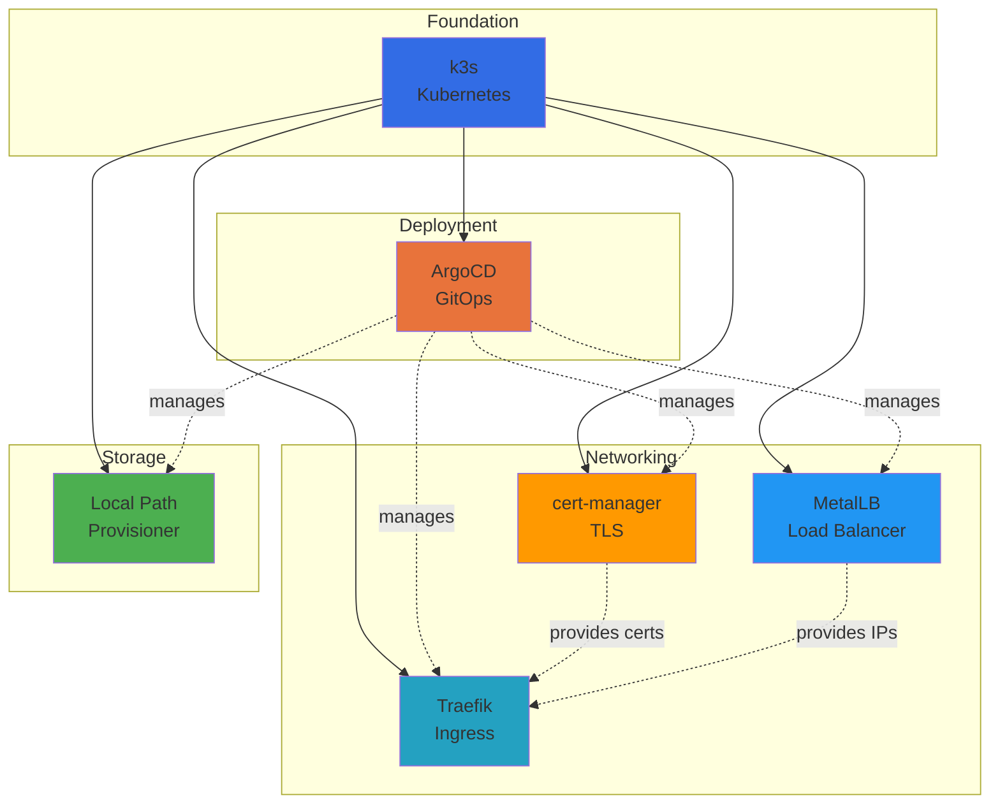

# Core Platform Services

The core platform consists of essential infrastructure components that power the entire homelab.



## Service Overview

| Logo | Service | Description | Version |
| ------ | --------- | ------------- | --------- |
|  | [k3s](https://k3s.io/) | Lightweight Kubernetes | Latest |
|  | [ArgoCD](https://argoproj.github.io/cd/) | GitOps Deployment | Latest |
|  | [Traefik](https://traefik.io/) | Ingress Controller | Latest |
|  | [cert-manager](https://cert-manager.io/) | Certificate Management | Latest |
|  | [MetalLB](https://metallb.universe.tf/) | Load Balancer | Latest |
|  | [Local Path Provisioner](https://github.com/rancher/local-path-provisioner) | Storage Provisioner | Latest |

## k3s

[k3s](https://k3s.io/) is a certified Kubernetes distribution built for IoT and Edge computing.

### Key Features

- Lightweight (< 100MB binary)
- Quick installation
- Built-in components
- Production-ready

### Configuration

```bash
# Install k3s
curl -sfL https://get.k3s.io | sh -

# Check status
sudo systemctl status k3s
```

[Learn more about Kubernetes Infrastructure →](../architecture/kubernetes-infrastructure.md)

## ArgoCD

[ArgoCD](https://argo-cd.readthedocs.io/) is a declarative, GitOps continuous delivery tool for Kubernetes.

### ArgoCD Key Features

- Git as source of truth
- Automated deployment
- Visual UI
- Drift detection

### Access

```bash
# Port forward to ArgoCD server
kubectl port-forward svc/argocd-server -n argocd 8080:443
```

Then visit `https://localhost:8080`

!!! note "Authentication"
    ArgoCD authentication is configured through the ArgoCD ConfigMap.
    Default credentials may be set during initial deployment or configured via SSO.

[Learn more about CI/CD →](../architecture/cicd.md)

## Traefik

[Traefik](https://traefik.io/) is a modern reverse proxy and load balancer.

### Traefik Key Features

- Automatic service discovery
- Let's Encrypt integration
- Middleware support
- Dashboard and metrics

### Traefik Configuration

IngressRoute CRDs define routing rules with host matching, service references, and TLS certificates.

[Learn more about Networking →](../architecture/networking.md)

## cert-manager

[cert-manager](https://cert-manager.io/) automates the management and issuance of TLS certificates.

### cert-manager Key Features

- Let's Encrypt integration
- Automatic renewal
- DNS-01 challenges
- Wildcard certificates

### Certificate Request

Certificate resources specify:

- Secret name for storing the certificate
- ClusterIssuer reference (e.g., letsencrypt-production)
- DNS names including wildcards (e.g., *.example.com)
- Automatic renewal before expiration

[Learn more about Security →](../architecture/security.md)

## MetalLB

[MetalLB](https://metallb.universe.tf/) is a load-balancer implementation for bare metal Kubernetes clusters.

### MetalLB Key Features

- Layer 2 mode (ARP)
- BGP mode available
- IP address pools
- Automatic assignment

### MetalLB Configuration

IPAddressPool defines the range of IPs MetalLB can assign. L2Advertisement announces these IPs on the local network
using ARP.

??? example "View MetalLB Configuration"
    ```yaml
    --8<-- "base/infra/metallb/metallb.yaml"
    ```

This configuration:

- Defines IP pool: `192.168.1.240/28` (16 addresses: .240-.255)
- Uses Layer 2 mode (ARP) for IP advertisement
- Automatically assigns IPs to LoadBalancer services

[Learn more about Networking →](../architecture/networking.md)

## Local Path Provisioner

[Local Path Provisioner](https://github.com/rancher/local-path-provisioner) provides persistent local storage
for Kubernetes workloads.

### Storage Features

- Dynamic volume provisioning
- Local host path storage
- Multiple storage classes
- Automatic directory creation

### Storage Classes

The platform uses separate storage classes for different namespaces:

- **local-path-infra**: Infrastructure services (`/opt/cluster/infra`)
- **local-path-utils**: Utility services (`/opt/cluster/utils`)
- **local-path-htpc**: Media services (`/opt/cluster/htpc`)

Each uses the `rancher.io/local-path` provisioner with `WaitForFirstConsumer` volume binding mode and `Retain` reclaim policy.

??? example "View Storage Classes Configuration"
    ```yaml
    --8<-- "base/infra/local-path-provisioner/storageclass.yaml"
    ```

**Key Configuration Points:**

- `volumeBindingMode: WaitForFirstConsumer` - Delays volume binding until pod is scheduled
- `reclaimPolicy: Retain` - Preserves data when PVC is deleted
- `nodePath` - Namespace-specific directory on the host node

[Learn more about Storage →](../architecture/storage.md)

## Related Documentation

- [Architecture](../architecture/index.md) - System architecture
- [Getting Started](../getting-started/index.md) - Deployment guide
- [Configuration](../configuration/index.md) - Configuration management
