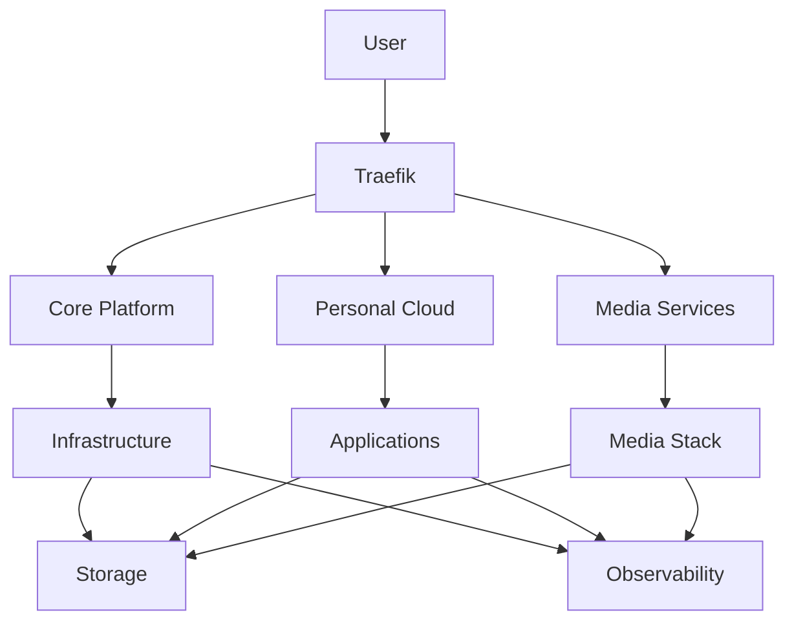

# Services

The platform hosts a comprehensive collection of services across three main categories:
core infrastructure, personal cloud applications, and media management.

## Service Categories

- :material-server:{ .lg .middle } [__Core Platform__](core-platform.md)

    ---

    Essential infrastructure services

    k3s, ArgoCD, Traefik, cert-manager, MetalLB, Local Path Provisioner

- :material-chart-line:{ .lg .middle } [__Observability Stack__](observability-stack.md)

    ---

    Monitoring, logging, and tracing

    Prometheus, Grafana, Loki, Jaeger, Alloy

- :material-cloud:{ .lg .middle } [__Personal Cloud__](personal-cloud.md)

    ---

    File sync, photos, recipes, dashboard

    Nextcloud, Homepage, Immich, Tandoor

- :material-movie:{ .lg .middle } [__Media Services__](media-services.md)

    ---

    Complete media automation stack

    Jellyfin, Sonarr, Radarr, Prowlarr, more

- :material-television:{ .lg .middle } [__Hardware Setup__](hardware-setup.md)

    ---

    Dedicated playback hardware

    Homatics Box, CoreElec, Kodi configuration

- :material-database:{ .lg .middle } [__Data Layer__](data-layer.md)

    ---

    Databases and caching

    CloudNativePG, Valkey, Redis

## Service Overview

All services are deployed as Kubernetes workloads with:

- __Declarative configuration__: YAML manifests
- __Persistent storage__: Where needed
- __Ingress routing__: HTTPS access via Traefik
- __Monitoring__: Prometheus metrics
- __Logging__: Centralized via Loki
- __High availability__: Configurable replicas

## Service Access

Services are accessible via:

- __Internal__: ClusterIP services within Kubernetes
- __External__: LoadBalancer or IngressRoute via Traefik
- __HTTPS__: TLS certificates from cert-manager
- __Dashboard__: Homepage service dashboard

## Service Architecture

## Next Steps

Explore detailed documentation for each service category:

- [Core Platform](core-platform.md) - Infrastructure services
- [Observability Stack](observability-stack.md) - Monitoring services
- [Personal Cloud](personal-cloud.md) - Cloud applications
- [Media Services](media-services.md) - Media automation
- [Hardware Setup](hardware-setup.md) - Client hardware
- [Data Layer](data-layer.md) - Databases and caching
