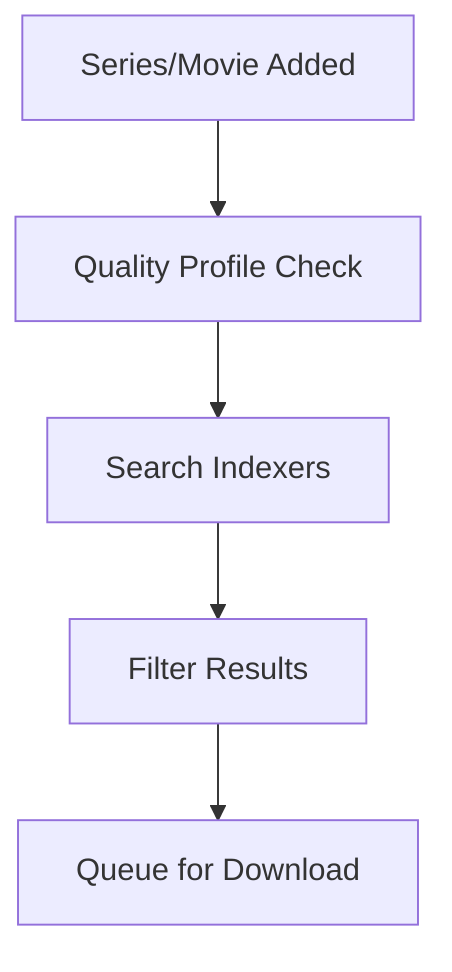
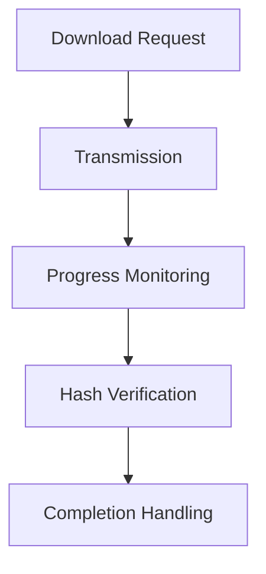
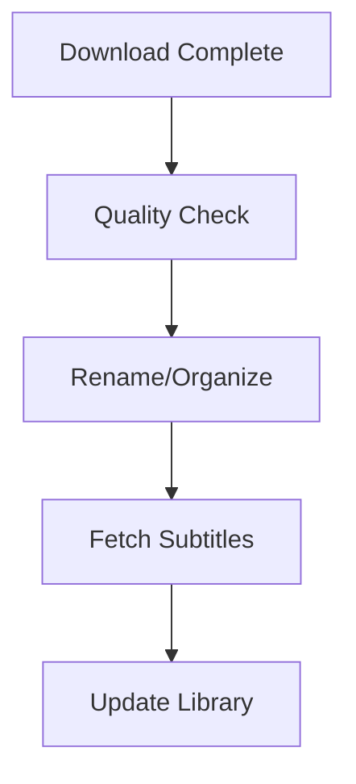

# Media Services

Complete media automation stack for content discovery, acquisition, and streaming.

## Service Overview

| Logo | Service | Description | Version |
| ------ | --------- | ------------- | --------- |
|  | [Jellyfin](https://jellyfin.org/) | Media Streaming | Latest |
|  | [Sonarr](https://sonarr.tv/) | TV Management | Latest |
|  | [Radarr](https://radarr.video/) | Movie Management | Latest |
|  | [Prowlarr](https://prowlarr.com/) | Index Management | Latest |
|  | [Transmission](https://transmissionbt.com/) | BitTorrent Client | Latest |
|  | [FlareSolverr](https://github.com/FlareSolverr/FlareSolverr) | CAPTCHA Solver | Latest |
|  | [Scraparr](https://github.com/TheCfu/Scraparr) | Metadata Scraper | Latest |

## Media Stack Architecture

The media management system is built on four key pillars:

### 1. Content Discovery 🔍

Automated series and movie tracking with quality management.

#### Components

- **Sonarr**: TV series management
- **Radarr**: Movie management
- **Prowlarr**: Indexer aggregation

### Process



### 2. Download Orchestration 📥

Automated download management with verification.

#### Download Components

- **Transmission**: BitTorrent client
- **FlareSolverr**: CAPTCHA bypass
- **Prowlarr**: Indexer integration

### Download Process



### 3. Post-Processing Pipeline 🔄

Automated file organization and metadata management.

#### Post-Processing Components

- **Sonarr/Radarr**: File organization
- **Scraparr**: Metadata scraping

#### Post-Processing Flow



### 4. Media Serving Strategy 🎬

Optimized streaming with hardware transcoding support.

#### Serving Components

- **Jellyfin**: Media server
- **Client devices**: Playback

#### Streaming Flow

```mermaid
graph TD
  A[Client Request] --> B[Format Check]
  B --> C{Can Direct Play?}
  C --> | Yes | D[Direct Play<br/>Original Format<br/>No Processing] |
  C --> | No | E{Can Direct Stream?} |
  E --> | Yes | F[Direct Stream<br/>Remux Container<br/>No Re-encoding] |
  E --> | No | G[Transcode<br/>Re-encode<br/>Server Processing] |
  D --> H[Bitstreaming Supported?]
  F --> H
  H --> | Yes | I[Hardware Passthrough] |
  H --> | No | J[Software Decode] |
```

## Service Details

### Jellyfin

Open-source media server for streaming content.

#### Jellyfin Features

- No subscription required
- Hardware acceleration support (Intel QuickSync via `/dev/dri/renderD128`)
- Multiple client apps
- Live TV and DVR support
- Mobile sync

??? example "View Jellyfin Hardware Acceleration Config"
    Jellyfin is configured with Intel GPU hardware acceleration:

    ```yaml
    # Volume mount for GPU access
    volumeMounts:
      - name: "render-device"
        mountPath: "/dev/dri/renderD128"

    volumes:
      - name: "render-device"
        hostPath:
          path: "/dev/dri/renderD128"

    # Security context for device access
    securityContext:
      privileged: true
      supplementalGroups:
        - 992  # render group
    ```

    This configuration enables:
    - Intel QuickSync hardware transcoding
    - Reduced CPU usage during transcoding
    - Support for multiple concurrent streams
    - Faster transcoding speeds

### Sonarr

TV series management and automation.

#### Sonarr Features

- Automatic episode downloading
- Quality management
- Calendar integration
- Series monitoring
- Upgrade management

### Radarr

Movie management and automation.

#### Radarr Features

- Automatic movie downloading
- Quality profiles
- Release monitoring
- Upgrade system
- List integration

### Prowlarr

Indexer manager and proxy.

#### Prowlarr Features

- Centralized indexer management
- Automatic synchronization
- Statistics tracking
- History logging

### Transmission

Lightweight BitTorrent client.

#### Transmission Features

- Web interface
- RSS feed support
- Bandwidth management
- Ratio limits
- Peer exchange

### FlareSolverr

Proxy server to bypass Cloudflare protection.

#### FlareSolverr Features

- CAPTCHA solving
- JavaScript rendering
- Cookie management
- Session handling

### Scraparr

Metadata scraping service.

#### Scraparr Features

- IMDb scraping
- TMDB integration
- Automatic metadata updates
- Prometheus metrics

## Storage

All media services share a common PVC:

??? example "View HTPC Storage Configuration"
    ```yaml
    --8<-- "base/htpc/persistent-volume-claim.yaml"
    ```

**Storage Details:**

- **htpc-pvc**: 500Gi shared persistent volume
- **Storage Class**: `local-path-htpc` (stores at `/opt/cluster/htpc`)
- **Access Mode**: ReadWriteOnce (single node access)
- **Usage**: Media library and application data

**Directory Structure:**

```text
/opt/cluster/htpc/
├── jellyfin/config/     # Jellyfin configuration
├── sonarr/config/       # Sonarr configuration
├── radarr/config/       # Radarr configuration
├── prowlarr/config/     # Prowlarr configuration
├── transmission/        # Download client data
└── data/media/          # Shared media library
    ├── tv/              # TV shows
    └── movies/          # Movies
```

**Performance Characteristics:**

- High throughput for large sequential files
- Optimized for streaming workloads
- Local disk performance

## Monitoring

### Grafana Dashboard

The HTPC dashboard monitors:

- Service health
- Error rates
- Resource usage
- Download queue
- Library stats

### Metrics

- Download speed
- Queue size
- Disk usage
- API response times
- Error rates

## Related Documentation

- [Hardware Setup](hardware-setup.md) - Client configuration
- [Architecture: Storage](../architecture/storage.md)
- [Architecture: Observability](../architecture/observability.md)
