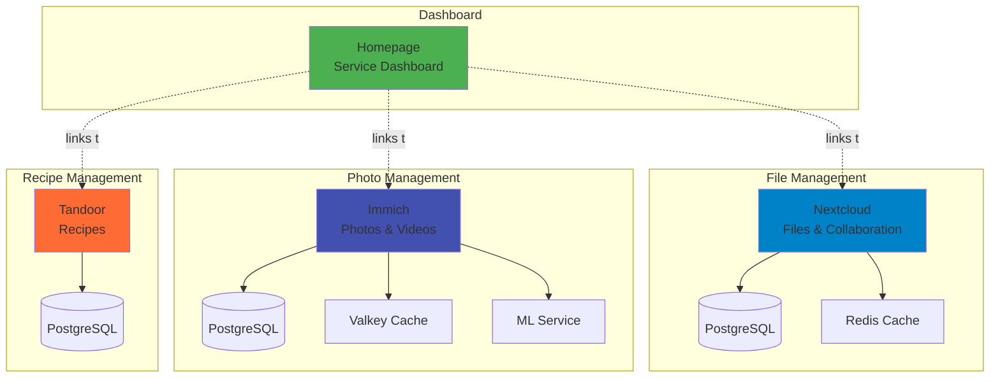

# Personal Cloud Services

Personal cloud applications for file management, photos, recipes, and service dashboard.



## Service Overview

| Logo | Service | Description | Version |
| ------ | --------- | ------------- | --------- |
|  | [Nextcloud](https://nextcloud.com/) | File Sync & Share | Latest |
|  | [Homepage](https://gethomepage.dev/) | Service Dashboard | Latest |
|  | [Immich](https://immich.app/) | Photo Management | Latest |
|  | [Tandoor](https://tandoorrecipes.com/) | Recipe Management | Latest |

## Nextcloud

Self-hosted file sync and collaboration platform.

### Nextcloud Features

- File synchronization
- Calendar and contacts
- Document editing
- Mobile apps
- Extensive app ecosystem

### Nextcloud Storage

??? example "View Nextcloud Storage Configuration"
    Storage is distributed across multiple PVCs:

    - **nextcloud-pvc**: 31Gi - Main application data
    - **nextcloud-redis-pvc**: 1Gi - Redis cache persistence
    - **PostgreSQL**: 10Gi - Database storage (managed by CNPG)

**Database Configuration:**

- **Engine**: CloudNativePG (PostgreSQL operator)
- **Storage**: 10Gi with `local-path-utils` storage class
- **Backup**: 30-day retention with volume snapshots
- **Parameters**: `max_connections: 100`, `shared_buffers: 256MB`

**Components:**

- Nextcloud application pod
- Redis cache for session and file locking
- PostgreSQL database cluster
- Cronjob for background tasks

### Nextcloud Access

Via Traefik ingress with TLS

## Homepage

Customizable service dashboard.

### Homepage Features

- Service status widgets
- System metrics
- Docker integration
- Kubernetes integration
- Weather widgets

### Homepage Configuration

Configured via ConfigMaps and supports dynamic service discovery.

**Features:**

- Kubernetes service discovery
- Widget-based layout
- Health status monitoring
- Custom bookmarks
- Weather and time widgets

**Configuration Location**: `base/utils/homepage/`

**Access**: Serves as the main landing page with links to all services

## Immich

High-performance photo and video management solution.

### Immich Features

- Mobile apps (iOS/Android)
- ML-powered search
- Facial recognition
- Location tracking
- Timeline view
- Shared albums

### Immich Storage

??? example "View Immich Storage Configuration"
    ```yaml
    # Immich PVCs from base/utils/persistent-volume-claim.yaml

    # Media Library
    - name: immich-library-pvc
      storage: 20Gi
      storageClass: local-path-utils

    # Valkey Cache
    - name: immich-valkey-pvc
      storage: 5Gi
      storageClass: local-path-utils

    # ML Models Cache
    - name: immich-ml-cache-pvc
      storage: 10Gi
      storageClass: local-path-utils

    # PostgreSQL Database (managed by CNPG)
    # Configured in base/utils/immich/postgres-cluster.yaml
    ```

**Total Storage**: 35Gi+ (library, cache, ML models, database)

**Database**: CloudNativePG-managed PostgreSQL cluster

### Immich Components

- Web interface
- Mobile apps
- ML service
- Valkey cache

## Tandoor

Recipe management and meal planning.

### Tandoor Features

- Recipe organization
- Shopping lists
- Meal planning
- Multi-user support
- Import from websites
- Nutrition tracking

### Tandoor Storage

??? example "View Tandoor Storage Configuration"
    - **tandoor-data-pvc**: 20Gi - Application data (media, static files)
    - **PostgreSQL**: Managed by CNPG operator
    - **Storage Class**: `local-path-utils`

**Components:**

- Tandoor application pod
- PostgreSQL database cluster (CNPG)
- Static media storage

### Tandoor Access

Web interface via Traefik

## Related Documentation

- [Architecture](../architecture/index.md)
- [Storage](../architecture/storage.md)
- [Configuration](../configuration/index.md)
